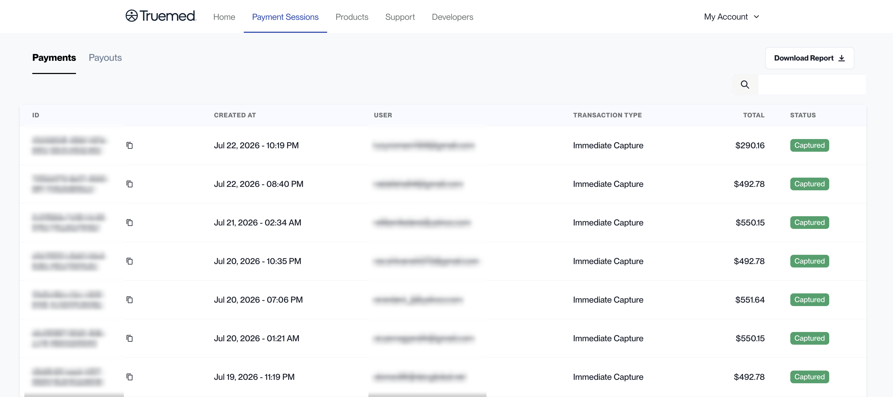
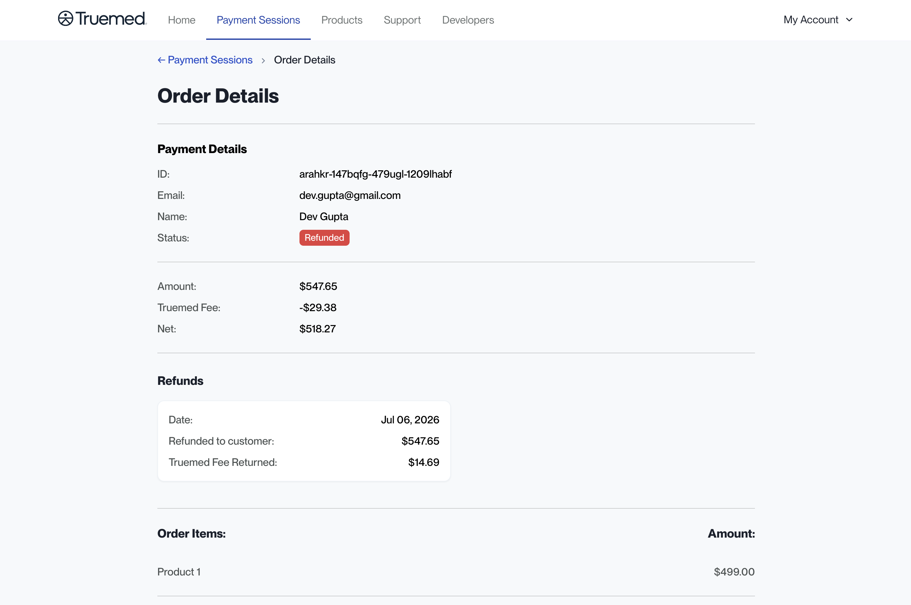
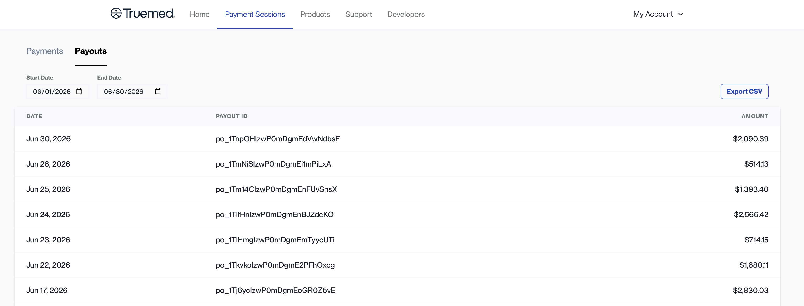
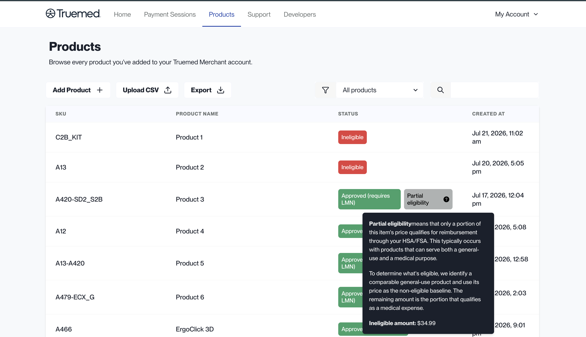
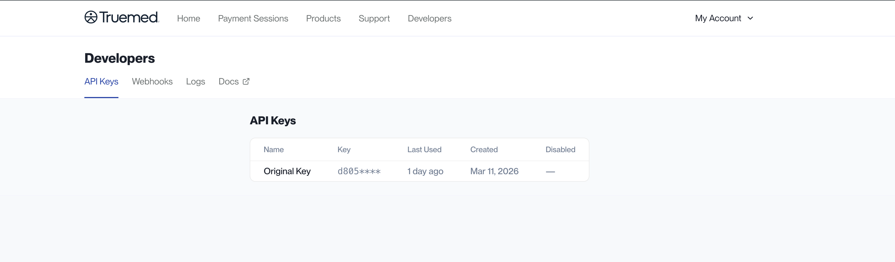
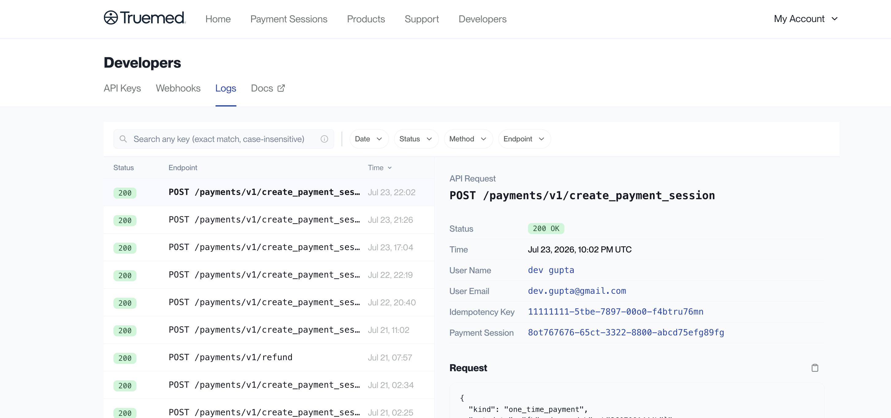

The Truemed Dashboard at [app.truemed.com](https://app.truemed.com) is where you monitor performance, review payment sessions and payouts, manage your product catalog, and manage your API integration. This guide walks through each section for merchants on the Truemed payment API integration.

<Note>
This overview is for merchants on the Truemed **payment API** integration. If you use the Shopify app, see [Dashboard Overview](/dashboard-overview-payments).
</Note>

***

## Home

When you sign in at [app.truemed.com](https://app.truemed.com), you land on the **Home** page. It shows the most important revenue and transaction data for your Truemed account.

At the top of the page you can set the **Date Range**, choose a period to **Compare to**, and set the **Date Granularity**. A banner shows your all-time totals (Revenue, Transactions, and Average Order Value), and a set of cards shows the metrics for the period you selected, each with the change from the comparison period:

- **Revenue**
- **Transactions**
- **AOV** (average order value)
- **LMN Approval Rate**

A Revenue chart plots your current period against the comparison period.

<Note>
LMN approval rates are provided for your team's internal use only. Because they relate to a telehealth process, please keep them internal.
</Note>

***

## Payment Sessions

The **Payment Sessions** page has two tabs: **Payments** and **Payouts**.

### Payments

The **Payments** tab lists every payment session processed through the Truemed payment API. For each payment you can see:

- **ID** (with a copy button to grab the full ID)
- **Created At**
- **User** (customer email)
- **Transaction Type** (for example, Immediate Capture)
- **Total**
- **Status**

Use the search box to find a specific payment, or click **Download Report** to export the list.

Each payment carries one of the following statuses:

| Status         | What it means                                                        |
| -------------- | -------------------------------------------------------------------- |
| **Incomplete** | The customer did not enter their credit card details                 |
| **Processing** | The order has been authorized but not yet captured                   |
| **Captured**   | The funds have been captured successfully                            |
| **Refunded**   | Part or all of the order has been refunded                           |

#### Order details

Each payment is clickable. Selecting one opens its **Order Details** page, which shows:

- **Payment Details**: the payment ID, customer email, customer name, and status
- **Amount**, **Truemed Fee**, and **Net**
- **Refunds**: if the payment has been refunded, the refund date, the amount refunded to the customer, and the Truemed fee returned
- **Order Items** with their individual amounts

<Note>
On the payment API integration, you can issue refunds directly through the API (`POST /payments/v1/refund`). Once a refund is processed, the payment shows a **Refunded** status and the refund details appear on its Order Details page.
</Note>

### Payouts

The **Payouts** tab lists the payouts deposited to your account. Filter by **Start Date** and **End Date**, and use **Export CSV** to download the list. Each row shows the **Date**, the **Payout ID**, and the **Amount**.

***

## Products

The **Products** section lists every product you have added to your Truemed account. For each item you can see the SKU, the product name, the status, and when it was created. You can search and filter by status, add new products individually or via CSV, and export your full list.

Each product is assigned an eligibility status, such as **Approved (requires LMN)**, **Pre-approved**, **Ineligible**, or **Partial eligibility**.

<Note>
**Partial eligibility** means only a portion of an item's price may qualify for HSA/FSA reimbursement. This applies to products that can serve both a general-use and a medical purpose. To determine the qualifying amount, Truemed identifies a comparable general-use product and treats its price as the non-eligible baseline; the remaining amount is the portion that may qualify as a medical expense.
</Note>

For step-by-step upload instructions and what each eligibility status means, see [SKUs](/skus).

***

## Support

**Support** is a menu in the top navigation with quick links to the resources you need as a Truemed merchant:

- **All Resources**
- **Marketing Resources**
- **Account Management Support**
- **About Truemed**

Each link opens in a new tab.

***

## Developers

The **Developers** section is where you manage your API integration. It has four tabs: **API Keys**, **Webhooks**, **Logs**, and **Docs**.

### API Keys

The **API Keys** tab lists your keys with their **Name**, a masked **Key**, when each was **Last Used**, when it was **Created**, and whether it is **Disabled**.

<Warning>
Treat your API keys like passwords. Keep them secret, never expose them in client-side code, and disable any key you believe has been compromised.
</Warning>

### Webhooks

The **Webhooks** tab is where you configure endpoints to receive event notifications from Truemed, so your systems can react to events like a completed payment or a refund.

### Logs

The **Logs** tab shows every API request your integration has made, with the **Status**, **Endpoint**, and **Time**. Filter by Date, Status, Method, or Endpoint, or search for a specific key.

Selecting a log entry opens the full **API Request** detail, including the status, time, user name and email, idempotency key, associated payment session, and the request body.

### Docs

The **Docs** tab opens the Truemed developer documentation in a new tab.

***

## Settings

Click **My Account** in the top right corner and select **Settings** to manage account details. Settings has two tabs:

- **Members**: everyone who has access to your Truemed Dashboard, along with their name, email, and role.
- **Public ID**: view and copy your public qualification ID when you need to share it.

For how to update your card on file, payout bank account, and other account details, see [Account Settings](/account-settings).

***

## Need Help?

For any dashboard or account questions, contact [merchants@truemed.com](mailto:merchants@truemed.com).
