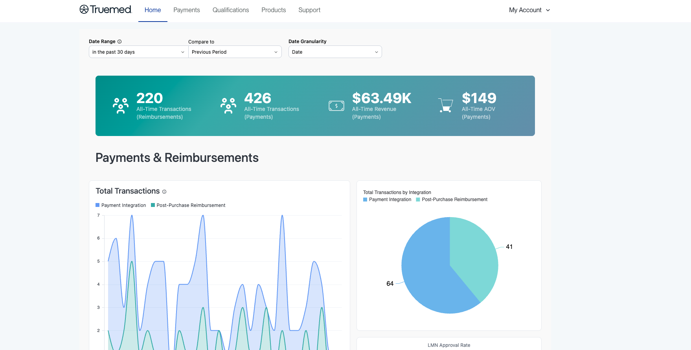
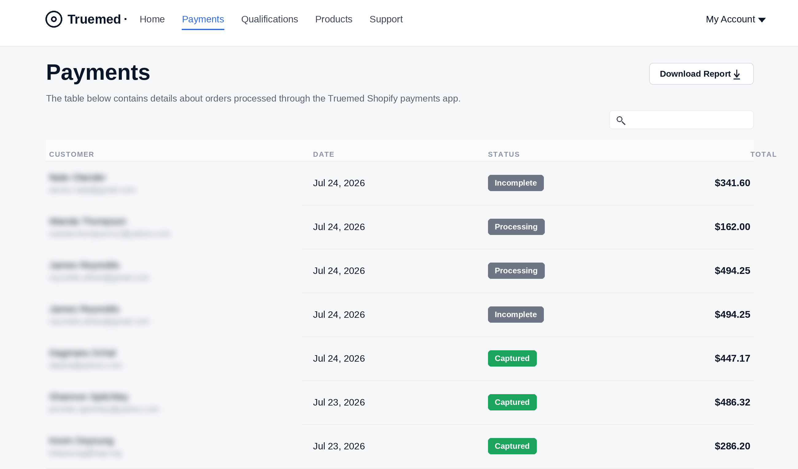
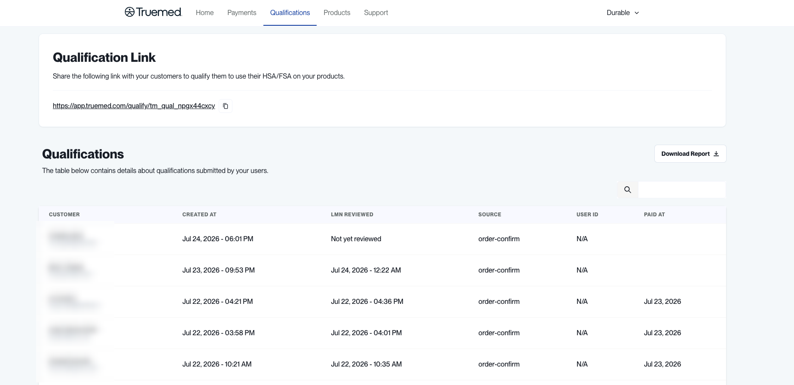
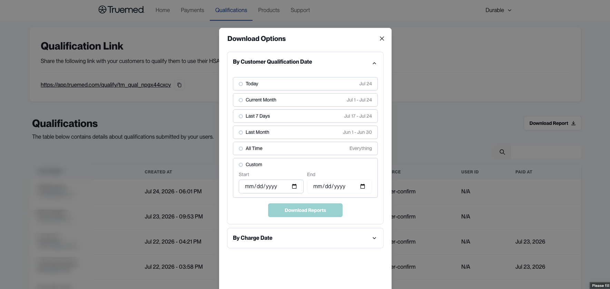
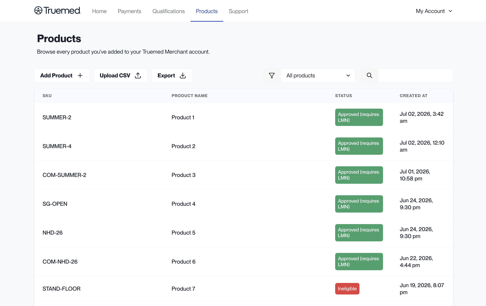
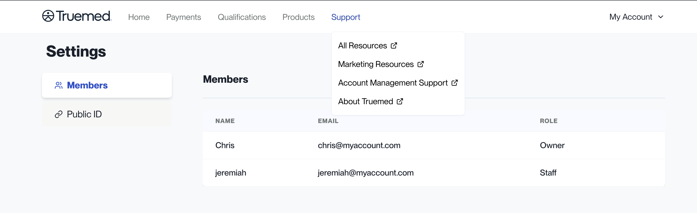
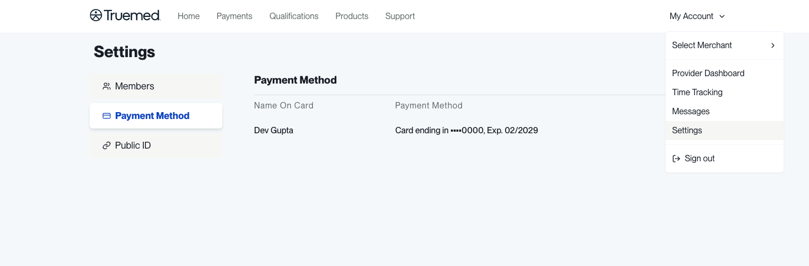

The Truemed Dashboard at [app.truemed.com](https://app.truemed.com) is where you monitor performance, review payments and qualifications, manage your product catalog, and control account settings. This guide walks through each section for hybrid merchants, who combine a payment integration with post-purchase reimbursements and sell subscription products.

<Note>
This overview is for **hybrid** merchants. If you use only the Shopify payment app, see [Dashboard Overview](/dashboard-overview-payments); if you use the payment API, see [Dashboard Overview for Payment API Merchants](/dashboard-overview-api).
</Note>

***

## Home

When you sign in at [app.truemed.com](https://app.truemed.com), you land on the **Home** page. Because your account combines both integrations, Home reports on payments and post-purchase reimbursements side by side.

At the top of the page you can set the **Date Range**, choose a period to **Compare to**, and set the **Date Granularity**. A banner shows your all-time totals, broken out by integration: **Transactions (Reimbursements)**, **Transactions (Payments)**, **Revenue (Payments)**, and **AOV (Payments)**.

Below that, the **Payments & Reimbursements** area shows:

- **Total Transactions**: a trend chart splitting Payment Integration from Post-Purchase Reimbursement
- **Total Transactions by Integration**: the same split as a share breakdown
- **LMN Approval Rate**

<Note>
LMN approval rates are provided for your team's internal use only. Because they relate to a telehealth process, please keep them internal.
</Note>

***

## Payments

The **Payments** page shows every payment attempt customers have made using the Truemed payment option. For each attempt you can see the customer name and email, the date, the status, and the total order amount. Use the search box to find a specific order, or click **Download Report** to export the list.

Each payment attempt carries one of the following statuses:

| Status         | What it means                                                        |
| -------------- | -------------------------------------------------------------------- |
| **Incomplete** | The customer did not enter their credit card details                 |
| **Processing** | The order has been authorized but not yet captured                   |
| **Captured**   | The funds have been captured successfully                            |
| **Refunded**   | Part or all of the order has been refunded on your end               |

***

## Qualifications

The **Qualifications** page is where you share your qualification link and review the qualification and Letter of Medical Necessity (LMN) requests tied to your customers' purchases. For subscription products, each purchase that runs through post-purchase qualification appears here.

At the top, the **Qualification Link** section holds the link you share with customers so qualified customers can use HSA/FSA funds on your products. Use the copy button to grab it.

The **Qualifications** table below lists the requests submitted by your users. For each one you can see:

- **Customer**
- **Created At**
- **LMN Reviewed** (the review date, or "Not yet reviewed")
- **Source** (for example, order-confirm)
- **User ID**
- **Paid At**

Click **Download Report** to export the data. You can pull it **By Customer Qualification Date** or **By Charge Date**, using preset ranges (Today, Current Month, Last 7 Days, Last Month, All Time) or a custom date range.

***

## Products

The **Products** section lists every product you have added to your Truemed account. For each item you can see the SKU, the product name, the status, and when it was created. You can search and filter by status, add new products individually or via CSV, and export your full list.

For step-by-step upload instructions and what each eligibility status means, see [SKUs](/skus).

***

## Support

**Support** is a menu in the top navigation with quick links to the resources you need as a Truemed merchant:

- **All Resources**
- **Marketing Resources**
- **Account Management Support**
- **About Truemed**

Each link opens in a new tab.

***

## Settings

Click **My Account** in the top right corner and select **Settings** to manage account details. Settings has three tabs:

- **Members**: everyone who has access to your Truemed Dashboard, along with their name, email, and role.
- **Payment Method**: the card on file for your account. As a subscription merchant, you add a payment method here to cover the cost of the Letters of Medical Necessity issued for your subscription purchases.
- **Public ID**: view and copy your public qualification ID when you need to share it.

For how to update your payout bank account and other account details, see [Account Settings](/account-settings).

***

## Need Help?

For any dashboard or account questions, contact [merchants@truemed.com](mailto:merchants@truemed.com).
