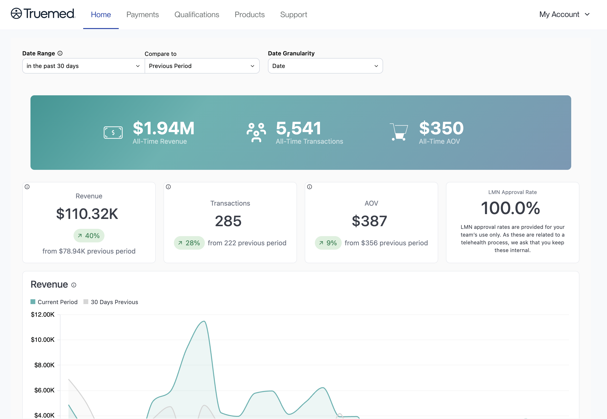
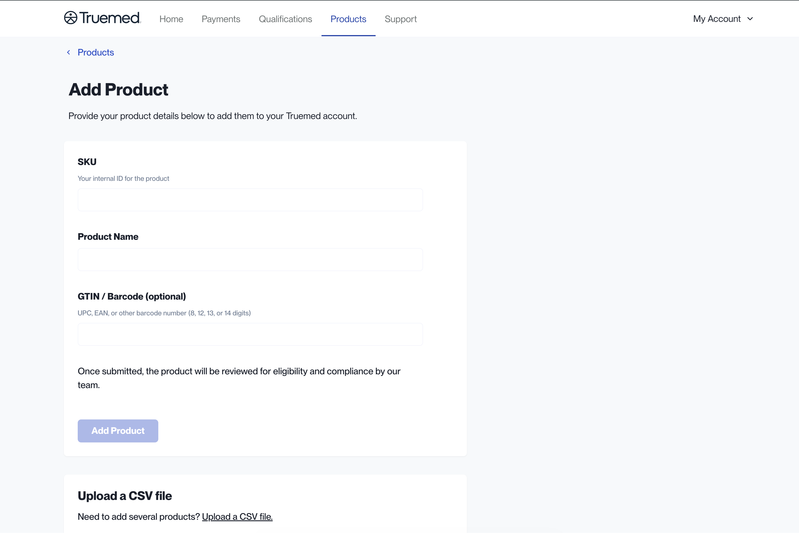
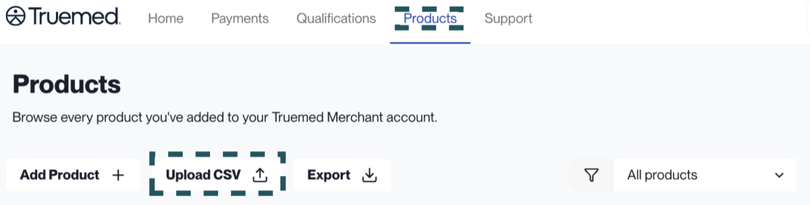
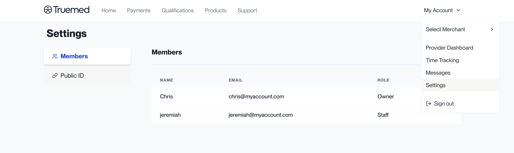

The Truemed Dashboard at [app.truemed.com](https://app.truemed.com) is where you monitor performance, review customer payments, manage your product catalog, and control account settings. This guide walks through each section so you know where to find what you need.

<Note>
This overview reflects the dashboard experience for **Shopify** merchants.
</Note>

***

## Home

When you sign in at [app.truemed.com](https://app.truemed.com), you land on the **Home** page. It shows the most important revenue and transaction data for your Truemed account.

At the top of the page you can control the view:

- **Date Range**: choose the period you want to see, for example the past 30 days
- **Compare to**: compare that period against the previous period
- **Date Granularity**: set how the data is grouped over time

A banner shows your **all-time** totals: All-Time Revenue, All-Time Transactions, and All-Time Average Order Value (AOV).

Below the banner, a set of cards shows the metrics for the period you selected, each with the change from the comparison period:

- **Revenue**
- **Transactions**
- **AOV** (average order value)
- **LMN Approval Rate**

A **Revenue** chart at the bottom plots your current period against the comparison period so you can see the trend over time.

<Note>
LMN approval rates are provided for your team's internal use only. Because they relate to a telehealth process, please keep them internal.
</Note>

***

## Payments

The **Payments** page contains details about orders processed through the Truemed Shopify payments app. For each order you can see the customer name and email, the date, the status, and the total order amount. Use the search box to find a specific order, or click **Download Report** to export the list.

Each order carries one of the following statuses:

| Status         | What it means                                                        |
| -------------- | -------------------------------------------------------------------- |
| **Incomplete** | The customer did not enter their credit card details                 |
| **Processing** | The order has been authorized but not yet captured                   |
| **Captured**   | The funds have been captured successfully                            |
| **Refunded**   | Part or all of the order has been refunded on your end               |

***

## Products

The **Products** section lists every product you have added to your Truemed Merchant account. For each item you can see the SKU, the product name, the status, and when it was created.

From this section you can:

- Search and filter your products by status
- Add new products individually or via CSV upload
- Export all existing products in the system

To add a product individually, click **Add Product** and provide:

- **SKU**: your internal ID for the product
- **Product Name**
- **GTIN / Barcode** (optional): a UPC, EAN, or other barcode number

Once submitted, the product is reviewed for eligibility and compliance by the Truemed team. To add many products at once, use **Upload CSV** instead.

### Keeping your SKUs current

Truemed uses your SKU as the primary identifier to verify eligibility at checkout, so keeping this list current is the most important thing you can do to make sure customers see accurate eligibility on your store. When a customer tries to check out with a product that has not been categorized, it defaults to ineligible until the Truemed compliance team reviews it.

Upload your product list on a regular cadence (monthly or quarterly), whenever you launch new products, and any time a customer reports a product showing as ineligible at checkout.

To prepare your list in Shopify:

1. Log in to your Shopify dashboard
2. Click the **Products** tab
3. In the upper right, click **Export**
4. Select **All Products** and **Plain CSV File**
5. Click **Export Products**

<Warning>
Make sure all product variants have a **Variant SKU** assigned before exporting. Items missing a SKU are skipped on upload.
</Warning>

Then upload the file from the **Products** tab using **Upload CSV**, or use **Add Product** to add SKUs individually. Both Owners and Staff can upload, view, and download SKU data.

Once uploaded, each product is assigned an eligibility status:

| Status                      | What it means                                                     |
| --------------------------- | ----------------------------------------------------------------- |
| **Awaiting Review**         | Submitted and pending review by the Truemed compliance team       |
| **Approved (requires LMN)** | May be HSA/FSA eligible with a Letter of Medical Necessity        |
| **Pre-approved**            | Eligible without an LMN, no clinical intake form needed           |
| **Partial Eligibility**     | Only part of the item qualifies; details are specified in the LMN |
| **Ineligible**              | Not approved for HSA/FSA spending                                 |

<Note>
Eligibility must be verified and assigned by Truemed's compliance team. You cannot manually tag products as HSA/FSA eligible in Shopify, and new products stay ineligible until the compliance team reviews them.
</Note>

***

## Support

**Support** is a menu in the top navigation. Opening it gives you quick links to the resources you need as a Truemed merchant:

- **All Resources**
- **Marketing Resources**
- **Account Management Support**
- **About Truemed**

Each link opens in a new tab.

***

## Settings

Click **My Account** in the top right corner and select **Settings** to manage account details. Settings has two tabs:

- **Members**: everyone who has access to your Truemed Dashboard, along with their name, email, and role (for example, Owner or Staff).
- **Public ID**: view and copy your public qualification ID when you need to share it.

### Updating account details

- **Card on file.** In the Truemed Dashboard, select **Settings** in the top right, click **Payment Method**, and update it. Only account Owners can update payment methods.
- **Linked bank account.** Your payout bank account is managed in your Truemed-linked Stripe account. Click the profile icon, select **Payout Details**, click the edit icon next to your current bank account, then enter and save your new details. Only users with admin access to your Stripe account can update payout information.
- **Business details.** Business information like your industry or EIN is managed in your Truemed-linked Stripe account, under **Platform Settings** in the **Business Details** section.

***

## Need Help?

For any dashboard or account questions, contact [merchants@truemed.com](mailto:merchants@truemed.com).
