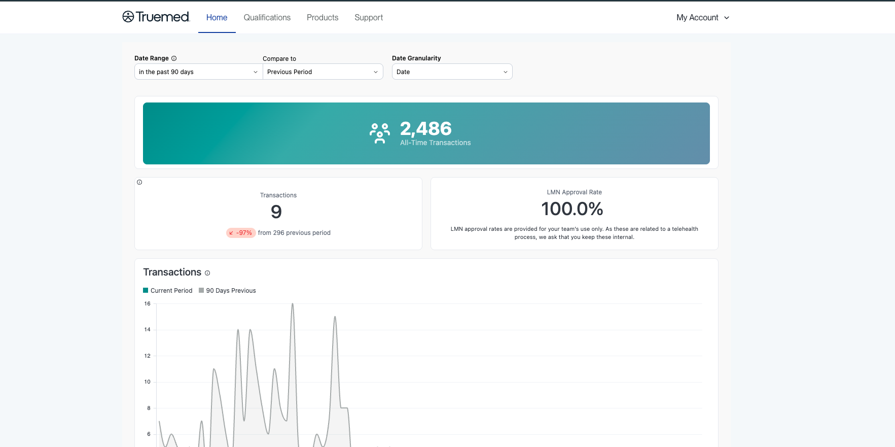

The Truemed Dashboard at [app.truemed.com](https://app.truemed.com) is where you monitor performance, review qualifications, manage your product catalog, and control account settings. This guide walks through each section for merchants running post-purchase reimbursements, where customers complete the clinical intake form after their purchase so qualified customers can use HSA/FSA funds.

<Note>
This overview is for **post-purchase reimbursement** merchants. If you also take payments through Truemed, see the [Hybrid](/dashboard-overview-hybrid) overview.
</Note>

***

## Home

When you sign in at [app.truemed.com](https://app.truemed.com), you land on the **Home** page. It shows the most important transaction data for your Truemed account.

At the top of the page you can control the view:

- **Date Range**: choose the period you want to see, for example the past 90 days
- **Compare to**: compare that period against the previous period
- **Date Granularity**: set how the data is grouped over time

A banner shows your **All-Time Transactions**. Below it, a set of cards shows the metrics for the period you selected:

- **Transactions**: the count for the selected period, with the change from the comparison period
- **LMN Approval Rate**

A **Transactions** chart at the bottom plots your current period against the comparison period so you can see the trend over time.

<Note>
LMN approval rates are provided for your team's internal use only. Because they relate to a telehealth process, please keep them internal.
</Note>

***

## Qualifications

The **Qualifications** page is where you share your qualification link and review the qualification and Letter of Medical Necessity (LMN) requests tied to your customers' purchases. Each purchase that runs through post-purchase qualification appears here.

At the top, the **Qualification Link** section holds the link you share with customers so qualified customers can use HSA/FSA funds on your products. Use the copy button to grab it. This link should typically be shared in post-purchase placements, such as the order confirmation page or a post-purchase email.

The **Qualifications** table below lists the requests submitted by your users. For each one you can see:

- **Customer**
- **Created At**
- **LMN Reviewed** (the review date, or "Not yet reviewed")
- **Source** (for example, order-confirm)
- **User ID**
- **Paid At**

Click **Download Report** to export the data. You can pull it **By Customer Qualification Date** or **By Charge Date**, using preset ranges (Today, Current Month, Last 7 Days, Last Month, All Time) or a custom date range.

Qualifications are batch-charged weekly on Thursdays. The charge date on a record reflects when your account was billed for that LMN issuance.

<Note>
Only the fields listed above are shown in the dashboard. No protected health information is displayed. All medical data submitted through the clinical intake form remains private.
</Note>

***

## Products

The **Products** section lists every product you have added to your Truemed account. For each item you can see the SKU, the product name, the status, and when it was created. You can search and filter by status, add new products individually or via CSV, and export your full list.

### Keeping your SKUs current

Truemed uses your SKU as the primary identifier to verify eligibility, so keeping this list current ensures customers see accurate eligibility. When a customer tries to check out with a product that has not been categorized, it defaults to ineligible until the Truemed compliance team reviews it. Upload your product list on a regular cadence (monthly or quarterly), whenever you launch new products, and any time a product is reported as ineligible.

Upload from the **Products** tab using **Upload CSV**, or use **Add Product** to add SKUs individually. If you sell on Shopify, export your catalog from Shopify's **Products** tab (**Export**, then **All Products** and **Plain CSV File**), making sure every variant has a **Variant SKU**. Otherwise, prepare a CSV with **Title**, **Handle**, **Variant SKU**, and **Description** columns. Both Owners and Staff can upload, view, and download SKU data.

Each product is then assigned one of these statuses:

| Status                      | What it means                                                     |
| --------------------------- | ----------------------------------------------------------------- |
| **Awaiting Review**         | Submitted and pending review by the Truemed compliance team       |
| **Approved (requires LMN)** | May be HSA/FSA eligible with a Letter of Medical Necessity        |
| **Pre-approved**            | Eligible without an LMN, no clinical intake form needed           |
| **Partial Eligibility**     | Only part of the item qualifies; details are specified in the LMN |
| **Ineligible**              | Not approved for HSA/FSA spending                                 |

<Note>
Eligibility must be verified and assigned by Truemed's compliance team; it cannot be self-assigned.
</Note>

***

## Support

**Support** is a menu in the top navigation with quick links to the resources you need as a Truemed merchant:

- **All Resources**
- **Marketing Resources**
- **Account Management Support**
- **About Truemed**

Each link opens in a new tab.

***

## Settings

Click **My Account** in the top right corner and select **Settings** to manage account details. Settings has three tabs:

- **Members**: everyone who has access to your Truemed Dashboard, along with their name, email, and role.
- **Payment Method**: the card on file for your account. You add a payment method here to cover the cost of the Letters of Medical Necessity issued for your customers' qualifications.
- **Public ID**: view and copy your public qualification ID when you need to share it.

### Updating account details

- **Card on file.** In the Truemed Dashboard, select **Settings** in the top right, click **Payment Method**, and update it. Only account Owners can update payment methods.
- **Linked bank account.** Your payout bank account is managed in your Truemed-linked Stripe account. Click the profile icon, select **Payout Details**, click the edit icon next to your current bank account, then enter and save your new details. Only users with admin access to your Stripe account can update payout information.
- **Business details.** Business information like your industry or EIN is managed in your Truemed-linked Stripe account, under **Platform Settings** in the **Business Details** section.

***

## Need Help?

For any dashboard or account questions, contact [merchants@truemed.com](mailto:merchants@truemed.com).
