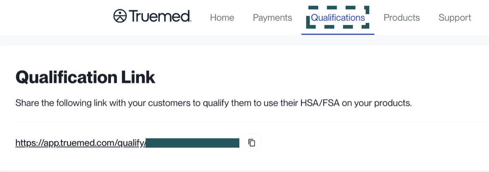

A **qualification** is an LMN issuance record for clinical intake forms that were initiated outside of a one-time payment or Shopify payment session. Qualifications typically occur in reimbursement flows or for subscription orders, where a customer has completed the medical qualification process independently of a direct purchase transaction.

The **Qualifications** tab in your Truemed Dashboard gives you a record of who has completed clinical intake forms, when their LMNs were issued, and when related billing actions occurred. Use it for reporting, auditing, and exporting a full record of qualified customers over time.

***

## What You Can View

From the Qualifications tab, you can view:

- **Customer Email.** Used to identify and verify qualified customers.
- **Survey Submission Date and Time.** When the customer completed their clinical intake form through Truemed.
- **Provider Review Date and Time.** When an independent licensed practitioner reviewed the intake and issued the LMN.
- **Charge Date.** When the merchant was billed for the qualification. Qualifications are batch-charged weekly on Thursdays.

<Note>
Only the details listed above are available in the dashboard. No protected health information is displayed. All medical data submitted through the clinical intake form remains private.
</Note>

***

## Accessing the Qualification Link

The Qualifications tab also gives you access to your **qualification link**, which is the URL customers use to complete the intake form. This link should typically only be shared in post-purchase environments with placements specific to your integration type (for example, the order confirmation page or post-purchase email).

***

## How to View Qualification Details

1. Log in to your [Truemed Dashboard](https://app.truemed.com)
2. Navigate to the **Qualifications** section
3. Use search or filter tools to locate a specific customer or date range
4. Open the customer's record to see timestamps for survey submission, provider review, and charge date
5. To export, click **Download Report** and sort by either *customer qualification date* or *charge date*

***

## Need Help?

- Reporting or export questions: [merchants@truemed.com](mailto:merchants@truemed.com)
- Truemed Dashboard: [app.truemed.com](https://app.truemed.com)
