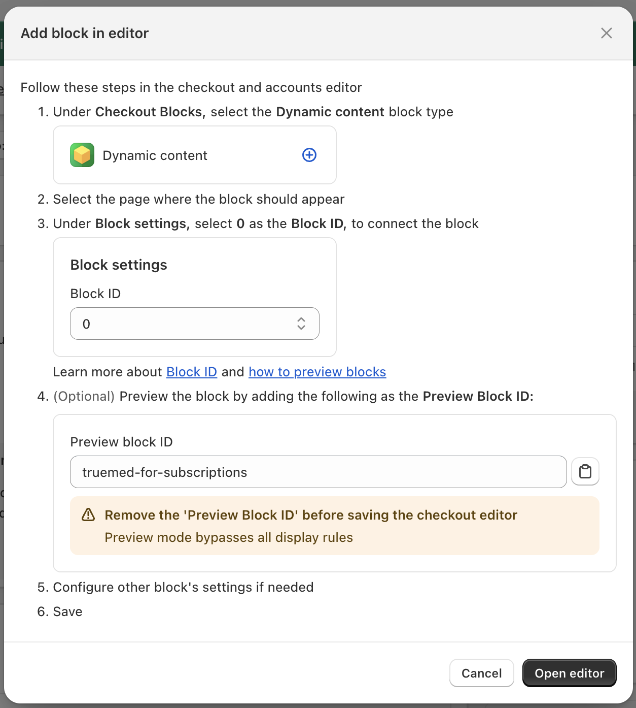
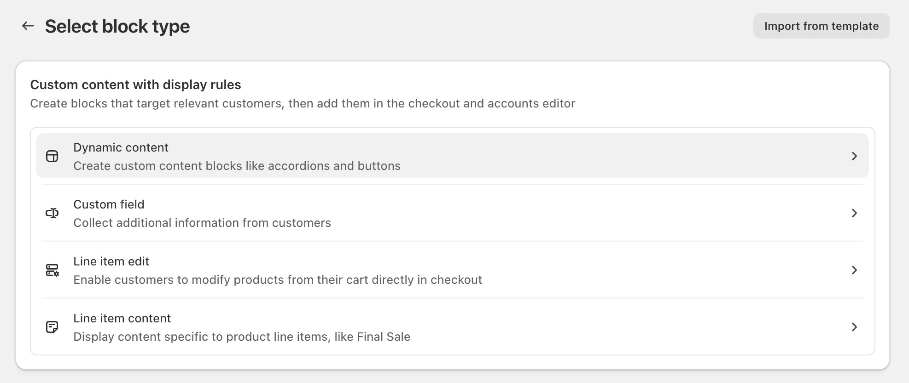
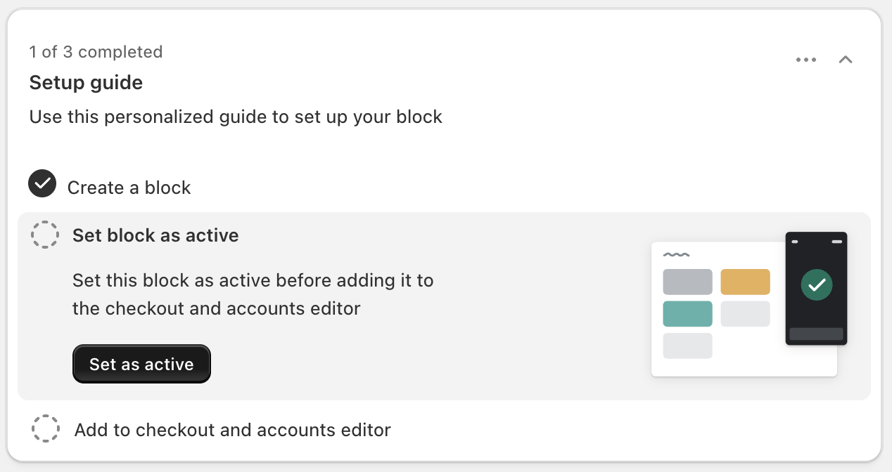
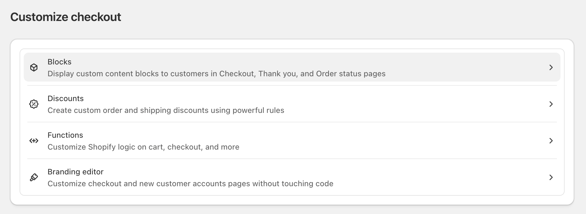
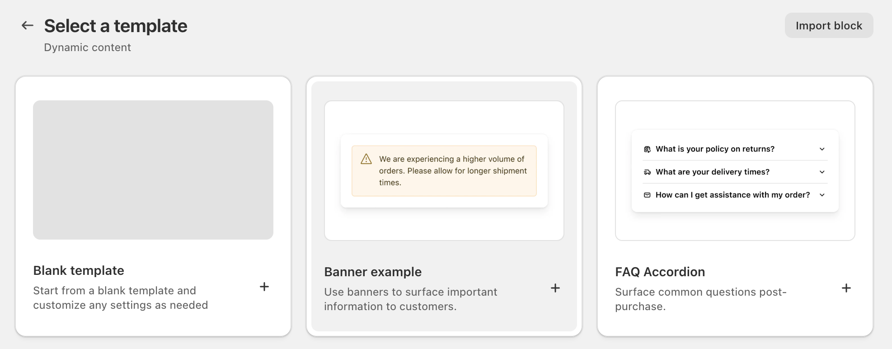
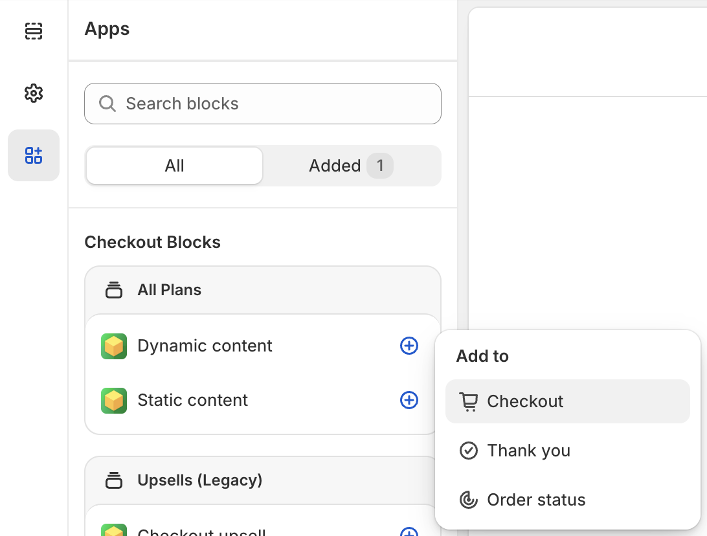
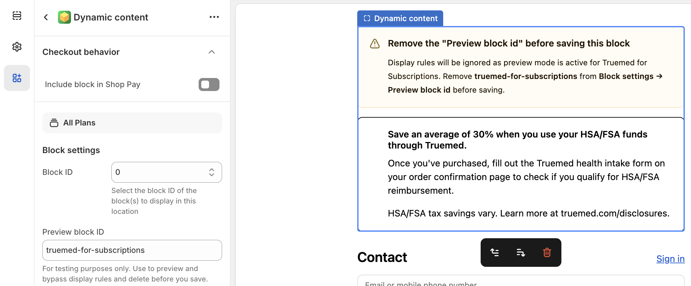
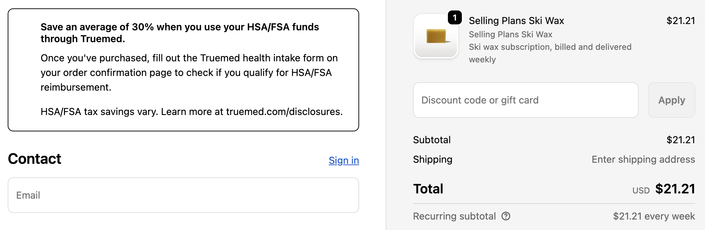

{/* Intercom article ID: 8795201 */}

---
title: Checkout Messaging for Subscription Products
subtitle: Add HSA/FSA messaging to your Shopify checkout page for subscription products using Checkout Blocks.
---

If you sell subscription products through Shopify and use Truemed's **qualification link** to support HSA/FSA eligibility, we recommend adding approved Truemed messaging directly to your **Shopify checkout page**. This ensures customers understand how to complete the qualification process and take advantage of potential tax savings.

---

## Why Add Checkout Messaging

Because subscription items require customers to complete the Truemed qualification and reimbursement process after purchase, clear expectations at checkout are especially important. This recommendation focuses on adding a lightweight checkout banner that informs customers how to take advantage of potential HSA/FSA tax savings post-purchase.

---

## The Solution: Checkout Blocks

**Checkout Blocks** is a widely used Shopify app that allows Shopify stores to conditionally display custom messaging and content directly within checkout. Many Shopify stores already use it to manage banners, disclaimers, and dynamic checkout content, and you may already have it installed. If not, installation is quick and does not impact existing checkout functionality.

We recommend using Checkout Blocks to display a conditional banner during checkout when a cart contains a subscription item (i.e. an item with a selling plan).

This approach is:

- Fast to implement
- Non-disruptive to checkout
- Dynamically shown only when relevant
- Works for all Shopify pricing tiers

---

## How to Add HSA/FSA Messaging at Checkout

### Step 1: Install Checkout Blocks (If Not Already Installed)

1. From your Shopify Admin, go to **Apps**
2. Visit the Shopify App Store
3. Search for Checkout Blocks
4. Install the app and follow Shopify's installation prompts

Once installed, Checkout Blocks will be available within your checkout customization tools.

### Step 2: Create the Truemed Checkout Banner Block

#### Create a Block

1. Click on Checkout Blocks on the left side navigation of your Shopify dashboard

2. Create a Dynamic Content Block

   

   

3. Select Banner Example

   

4. Add a Block Name, limit the Publishing Region to United States, and create a Display Rule so the contents will only display when any single line item has a selling plan

   

5. Click "Edit" in the Content Items > Banner section and input the Banner Copy with the Banner Status "Plain banner"

   #### Banner Copy (Use Exactly as Written)

   **Title**

   > Save an average of 30% when you use your HSA/FSA funds through Truemed.

   **Content**

   > Once you've purchased, fill out the Truemed health intake form on your order confirmation page to check if you qualify for HSA/FSA reimbursement.
   >
   > HSA/FSA tax savings vary. Learn more at [truemed.com/disclosures](http://truemed.com/disclosures).

6. Save your changes in the top bar of your Shopify dashboard

   

7. Follow the Setup Guide to set the block as active and add it to checkout

   

   

<Note>
If you used a different Block Name or Block ID, your instructions here may look slightly different. Make sure you follow the customized instructions provided in your app.
</Note>

8. Open the editor and add a Dynamic Content block to Checkout

   

9. Use the Block ID referenced in Step 7 to add your custom block to your Checkout page

   

<Warning>
You won't see the new copy unless you input the Preview Block ID. Make sure you remove this ID before saving the block -- your customers will see the contents at checkout even though you can't see it in the editor.
</Warning>

10. Click **Save** in the upper-right of the window.

---

## What Customers Will See

When a customer checks out with a subscription item:

---

## Need Help?

If you have questions about adding checkout messaging or need implementation support, contact Truemed's merchant support team at [merchants@truemed.com](mailto:merchants@truemed.com).
