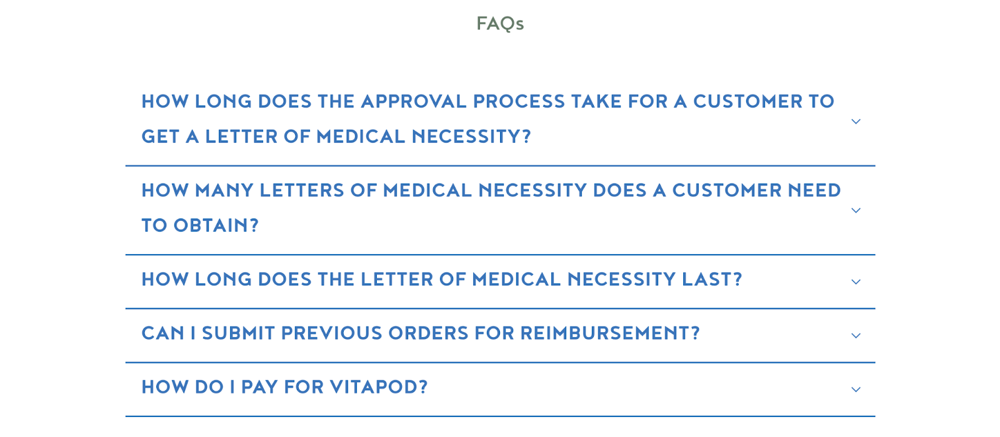

{/* Intercom article ID: 4657985 */}

---
title: FAQ Page Updates
subtitle: Provide answers upfront to questions customers may have about HSA/FSA eligibility
---

Provide answers upfront to questions customers may have about HSA/FSA eligibility by taking a few minutes to update your FAQs.

## How to Update FAQs If You Have an HSA/FSA Landing Page

Add this question to your FAQ:

<Tip>
**Is [Merchant Name] HSA/FSA eligible?**

Yes! Through our partnership with [Truemed](https://www.truemed.com/blog/how-to-spend-hsa-funds), you may be eligible to pay for your [Merchant Name] purchase with your HSA/FSA. Learn more (link to your landing page).
</Tip>

## How to Update FAQs If You Do Not Have an HSA/FSA Landing Page

Copy and paste these questions and answers to your FAQs:

- [**FAQ Guide**](https://support.truemed.com/en/articles/2567233) for merchant partners with our Shopify/payments integration who **do not** have any subscription products
- [**FAQ Guide**](https://support.truemed.com/en/articles/2567745) for merchant partners with our Shopify/payments integration who **do** offer subscription products
