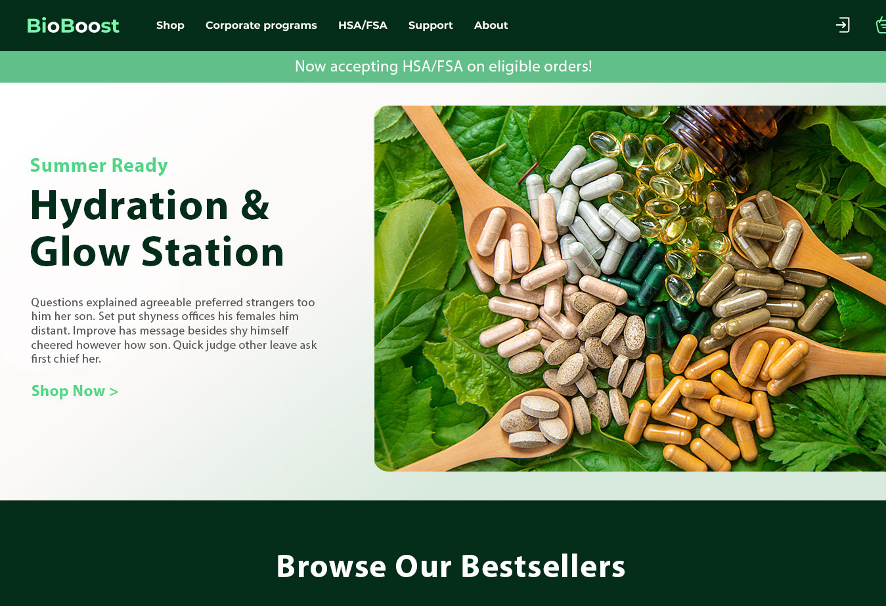
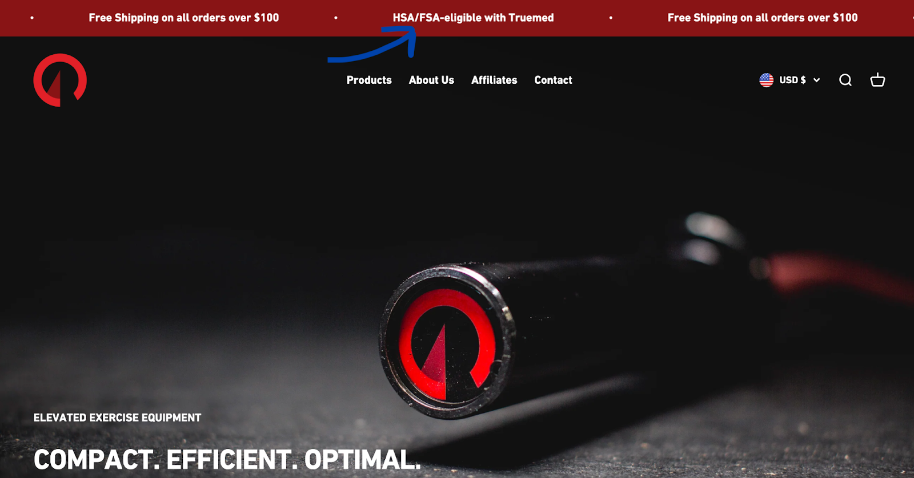
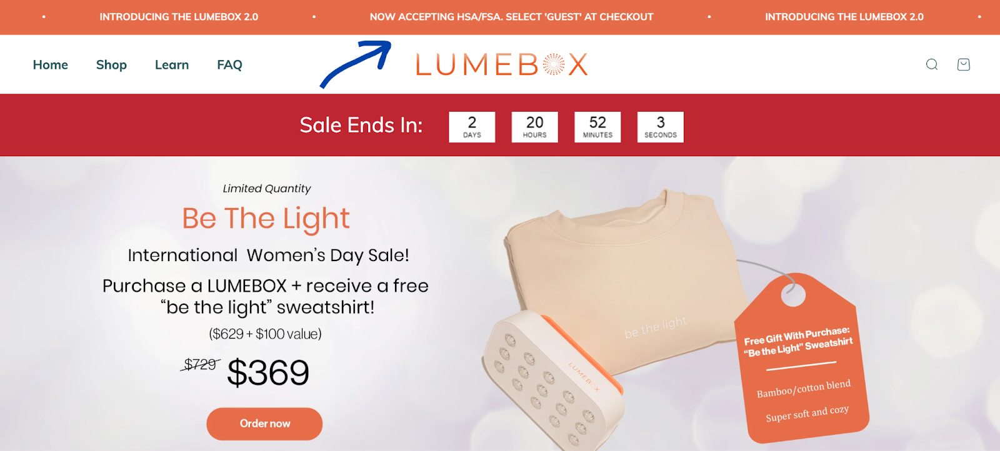

{/* Intercom article ID: 4657921 */}

Adding a site-wide HSA/FSA banner ensures every visitor knows they may be eligible to use pre-tax funds -- making it clear, compelling, and impossible to miss.

## How To Add An HSA/FSA Banner

Using the tools you built your site with, create a banner at the top of your homepage and paste in the text below. Link the CTA to your [Truemed Landing Page](/resources/hsa-fsa-landing-page) or to your [HSA/FSA Eligible Product Collection](/resources/hsa-fsa-eligible-product-collections).

**Sample Copy**

- HSA/FSA Eligible\*: Learn more.
- HSA/FSA Eligible: Save an average of 30%\*
- Now Accepting HSA/FSA on Eligible Orders\*

<Note>
**Important:** Please include our compliance disclaimer on any HSA/FSA messaging:

\*Truemed is for qualified customers. HSA/FSA tax savings vary. Learn more at [truemed.com/disclosures](http://truemed.com/disclosures)

For site banners, you can include the disclaimer just above your footer navigation. If the disclaimer is missing, we may ask you to update or remove the asset.
</Note>

### Compliance Reminder

Following Truemed's compliance guidelines protects customers from misleading claims and keeps your brand aligned with IRS/HSA/FSA rules, reducing the risk of ad rejections or takedowns. It also preserves trust and lowers the chance of disputes or chargebacks by setting accurate expectations about eligibility and savings.

Please include our compliance disclaimer on any HSA/FSA messaging:

> \*Truemed is for qualified customers. HSA/FSA tax savings vary. Learn more at [truemed.com/disclosures](http://truemed.com/disclosures)

If the disclaimer is missing or if your ad copy is misleading, incomplete, or otherwise non-compliant with the law or your agreement with Truemed, we may ask you to update or remove the asset. If you'd like our team to review marketing assets prior to go-live, email us at [merchants@truemed.com](mailto:merchants@truemed.com).

Need more guidance on what you can say about HSA/FSA? Review the [**Compliant HSA/FSA Messaging Guide**](https://support.truemed.com/en/articles/2489153) and remember to add our required disclaimer with any savings claims.

**Additional Examples:**

