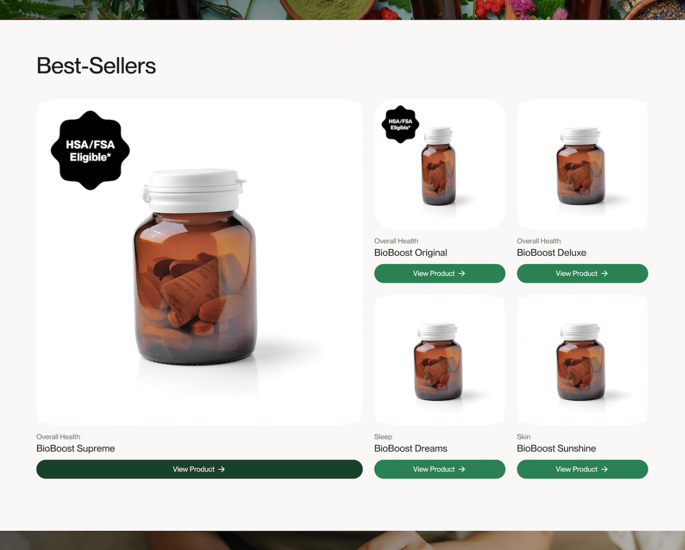

{/* Intercom article ID: 5809153 */}

Making it easy for customers to find HSA/FSA-eligible products is one of the simplest ways to increase conversion rates and build trust. By adding clear tags, badges, or filters, you're removing friction and guiding high-intent shoppers to the right products.

---
---

## Why This Matters

Most shoppers don't realize they can use their HSA/FSA funds for your products -- until you show them.

Adding **"HSA/FSA Eligible"** language throughout your site helps:

- Improve customer confidence
- Increase average order value
- Reduce browsing friction
- Boost overall conversion rates

---
---

## Where to Add Filters or Badges

**1. Collection Pages**
Create a dedicated collection page labeled **"HSA/FSA Eligible"** so customers can browse all eligible items in one place.

**2. Product Filters**
Add a filter in your navigation (or sidebar) that lets customers **sort by eligibility**. This is especially useful if your catalog is large or has mixed eligibility.

**3. Product Badges or Labels**
Display an [**"HSA/FSA Eligible" badge**](https://support.truemed.com/resources/highlight-eligible-products-with-hsa-fsa-badges) on the product thumbnail and/or product detail page (PDP). This draws immediate attention to qualifying items.

---
---

## How to Add an HSA/FSA Eligible Filter

**Add an HSA/FSA eligible filter in under 10 minutes by following our guide, [here](https://blank-app-2ya8z7acp3l.streamlit.app/).**

Please reach out to us at [merchants@truemed.com](mailto:merchants@truemed.com) if you have any questions!

---
---

### Real-World Results

Merchants who implement these changes often see:

- **Higher conversion rates**
- **More confident, faster purchasing decisions**
- **Increased cart sizes from HSA/FSA buyers**

Even small UX improvements like these make a big difference in performance.

## HSA/FSA Eligible Badges

Add badges to HSA/FSA eligible products so customers can easily identify eligible items.

**Download assets [here](https://support.truemed.com/resources/highlight-eligible-products-with-hsa-fsa-badges).**
