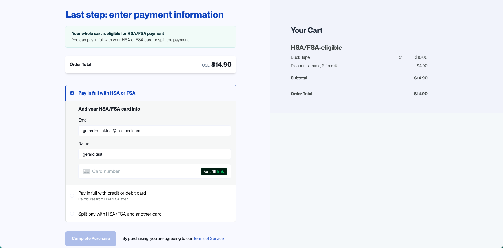
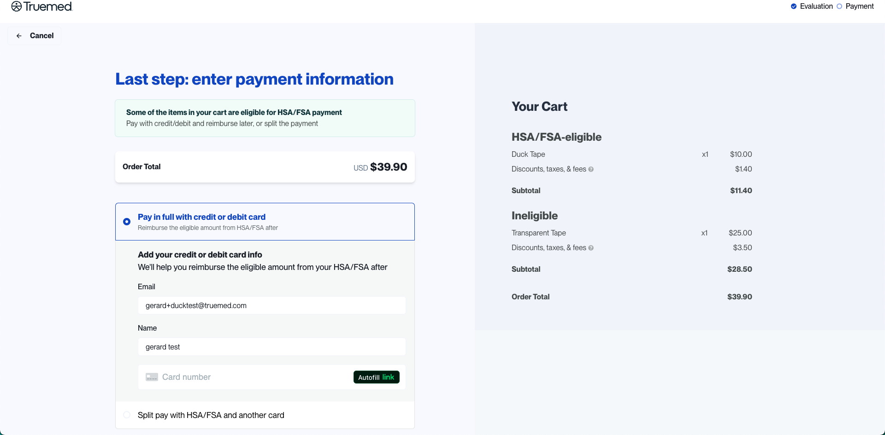
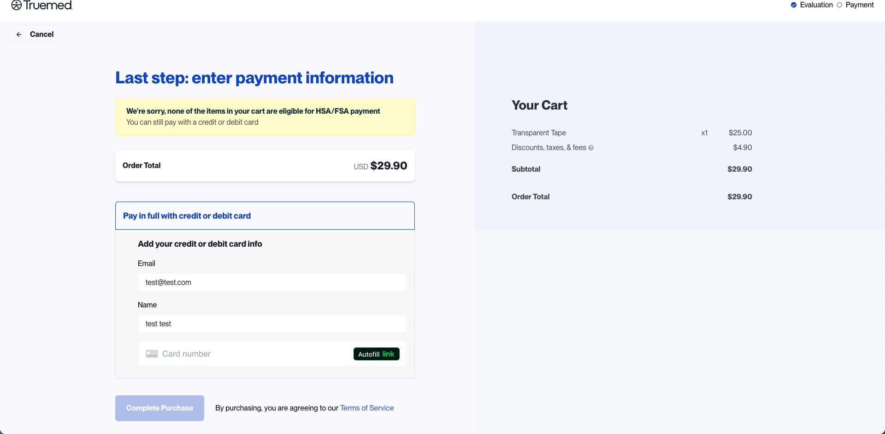

{/* Intercom article ID: 5427009 */}

---
title: "Multicard Checkout: Split Payments with HSA/FSA & Personal Cards"
subtitle: A seamless way for customers to split their payment between an HSA/FSA card and a personal debit or credit card
---

We're excited to announce the launch of **Truemed's new checkout experience**: **Multicard Checkout** -- a seamless way for customers to split their payment between an HSA/FSA card and a personal debit or credit card.

This feature is designed to reduce failed payments and abandoned checkouts, whether a customer is purchasing fully eligible items or a mix of eligible and ineligible ones.

Watch the multicard checkout experience [**here**](https://www.loom.com/share/a140239f6da64f5ba6d8838283d913aa?sid=17afcc8b-3997-46d4-891f-6f419ab57a21).

## Multicard Checkout Options

With the new experience, your customers can now choose from a variety of payment options based on their cart contents:

### Fully Eligible Carts

- Pay in full with HSA or FSA
- Pay in full with debit or credit card
- **Split payment** between HSA/FSA and a personal card

### Mixed Carts (Eligible + Ineligible Items)

- Pay in full with debit or credit card
- **Split payment** between HSA/FSA (for eligible items) and a personal card (for ineligible items)

### Fully Ineligible Carts

- Pay in full with debit or credit card

## Why It Matters

This feature was built to eliminate two major checkout pain points:

### 1. For Fully Eligible Carts

If a customer's HSA/FSA card doesn't cover the full amount (due to daily limits or insufficient balance), they can now cover the remaining balance with a personal card -- no failed transaction, no lost sale.

### 2. For Mixed Carts

Customers can now split payment automatically, using their HSA/FSA card for eligible items and a personal card for the rest. This removes the need for reimbursements and makes the process frictionless.

## Fully Eligible Cart

## Mixed Cart (Eligible and Ineligible Items)

## Fully Ineligible Cart

