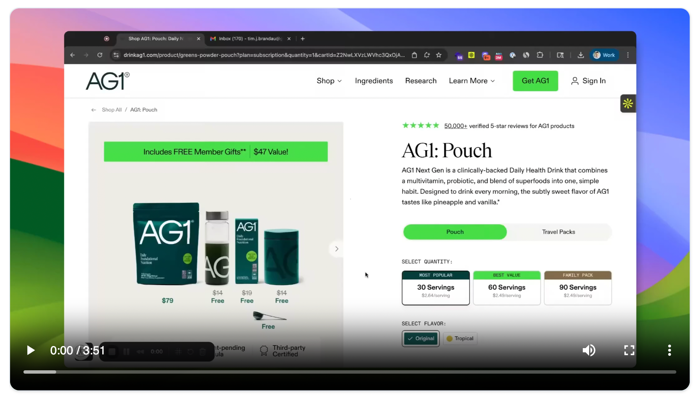
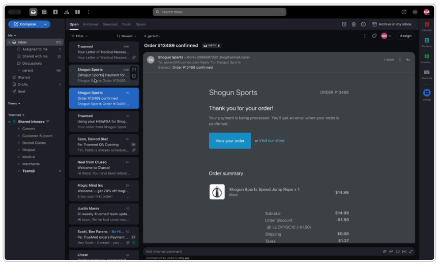
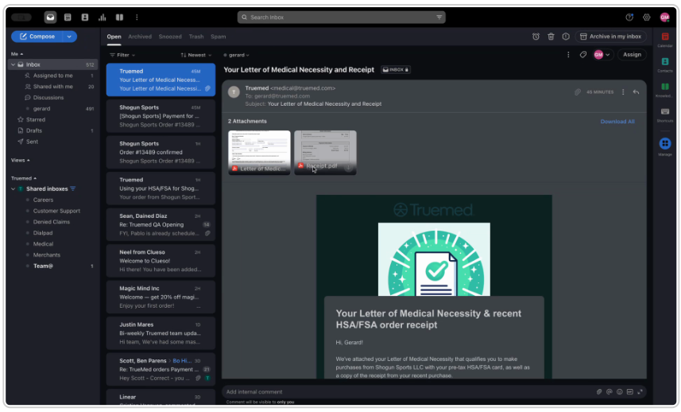

{/* Intercom article ID: 2889537 */}

---
title: Order Authorization and Medical Necessity Process
subtitle: Understanding what happens after an order is authorized but not yet captured
---

**Watch the demo [here](https://app.trupeer.ai/view/cWXd99QzH).**

This guide explains the process a customer goes through after an order is authorized but not yet captured. It details the communications received by the customer, the possible outcomes, and the subsequent steps.

## Order Authorization and Medical Necessity Review

**Step 1:** After order authorization, the customer receives an email notification. This email informs them that the order is placed and the provider is reviewing the letter of medical necessity.

**Step 2:** The customer also receives a confirmation email from the merchant.

## Approval of Medical Necessity Letter

**Step 1:** Upon approval of the letter of medical necessity, the customer receives a payment confirmation from the merchant.

**Step 2:** The customer also receives instructions on how to access their letter of medical necessity, including all the details they provided, and a receipt for their recent purchase.

## Rejection of Medical Necessity Letter

**Step 1:** If the letter of medical necessity is rejected, the customer receives an email notification of the rejection.

**Step 2:** The customer sees a canceled payment from the merchant. The payment does not process on their HSA/FSA card.
