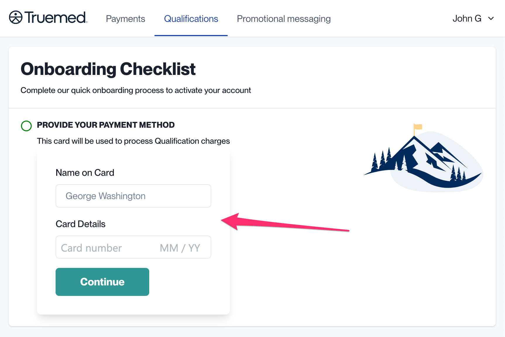

{/* Intercom article ID: 2474753 */}

---
title: Order Confirmation Widget
subtitle: Encourage HSA/FSA reimbursement immediately post-purchase with a confirmation page widget.
---

<Note>
These instructions are specific to reimbursement implementations. They are not necessary to support the Truemed payment app.
</Note>

## Encourage HSA/FSA Reimbursement Immediately Post-Purchase

These instructions will help you include a link to qualification for HSA/FSA reimbursement on the post-purchase page of your online store.

For example, on a Shopify store, that looks like this:


Truemed provides a custom widget to make this very simple for Shopify stores, but we also provide generic instructions below.

---

## Shopify Instructions

1. Locate your Qualification Link at [app.truemed.com](http://app.truemed.com)

   

2. On your Shopify admin panel, navigate to **Settings** > **Checkout** > **Additional Scripts**

3. Paste the following into the box for **Order status page** (remember to replace `YOUR_QUALIFICATION_LINK` with the link found in Step 1):

```html
<div id="truemed-reimburse" data-url="YOUR_QUALIFICATION_LINK"></div>
<script src="https://truemed-public.s3.us-west-1.amazonaws.com/truemed-ads/confirmation-widget-v1.1.min.js"></script>
```

---

## Non-Shopify Instructions

It's also easy to add this CTA on any store:

1. Locate Your Qualification Link (same instructions as Step 1 above)

2. On your post-purchase page, add a CTA with the following code:

```html
<p>This order might be eligible for HSA/FSA reimbursement. <a href="YOUR_QUALIFICATION_LINK?source=post_purchase">Get Reimbursed</a>.</p>
```

---

## Need Help?

Contact [merchants@truemed.com](mailto:merchants@truemed.com) for any technical questions about the order confirmation widget.
