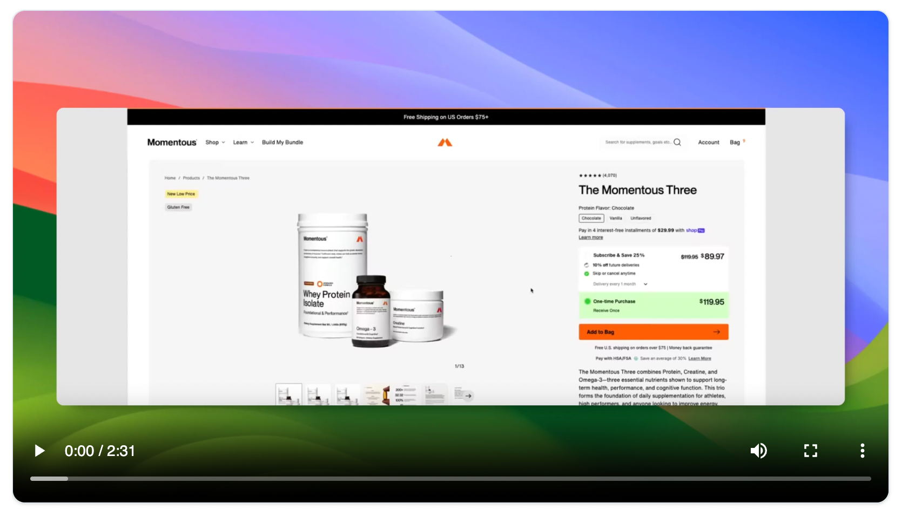
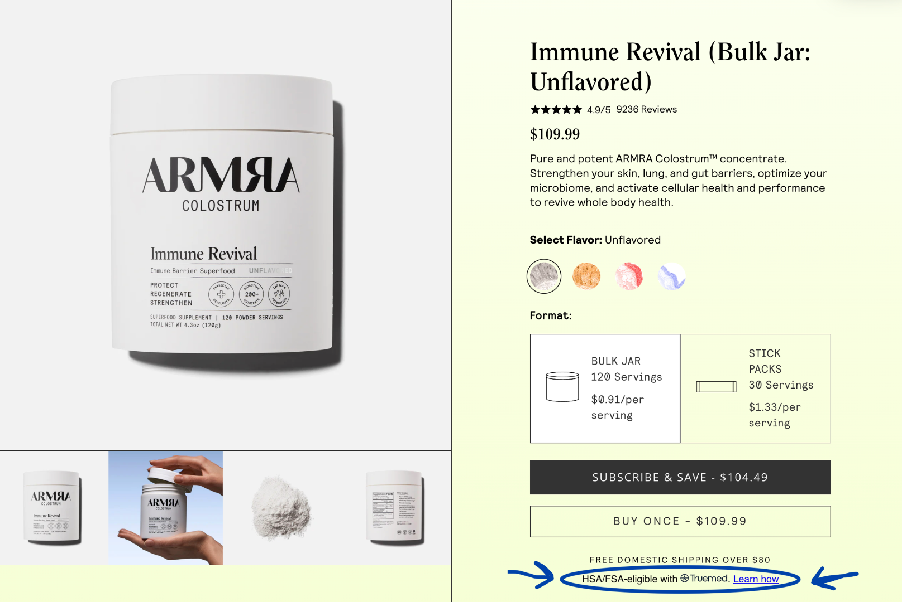
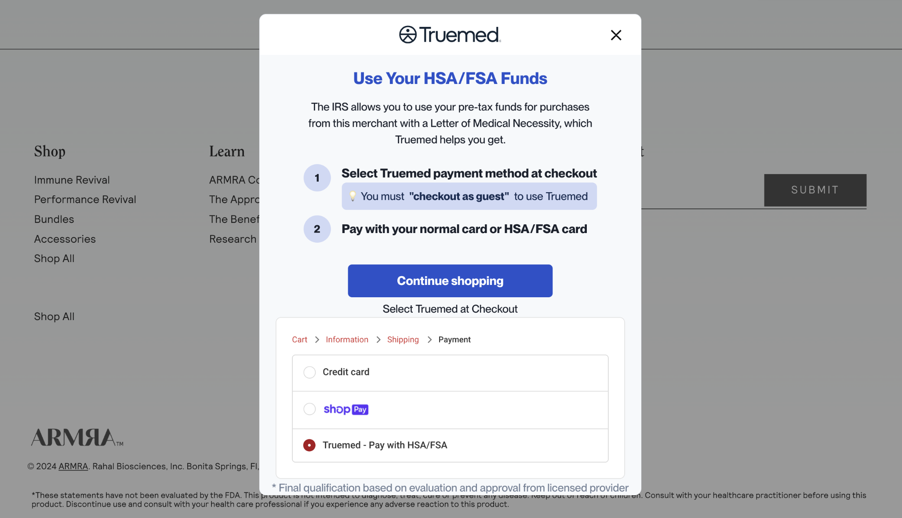
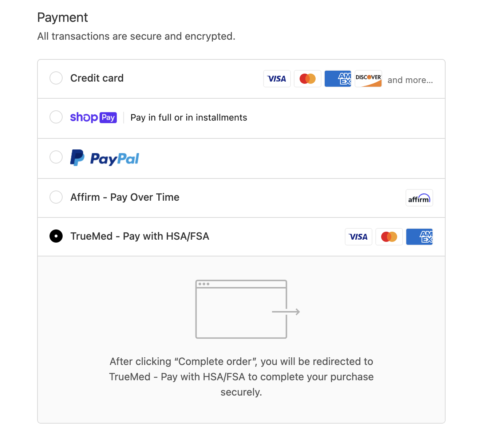
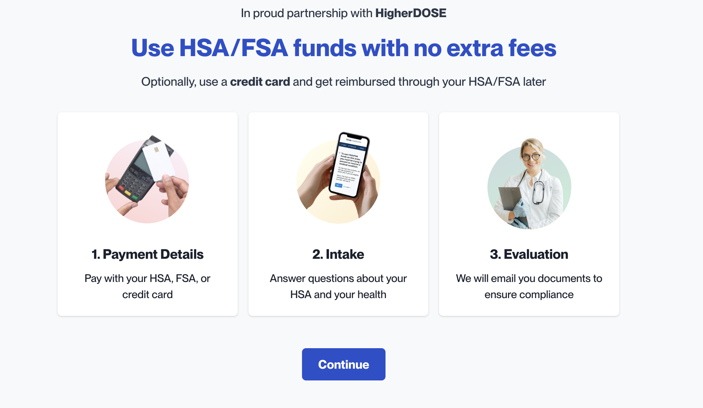
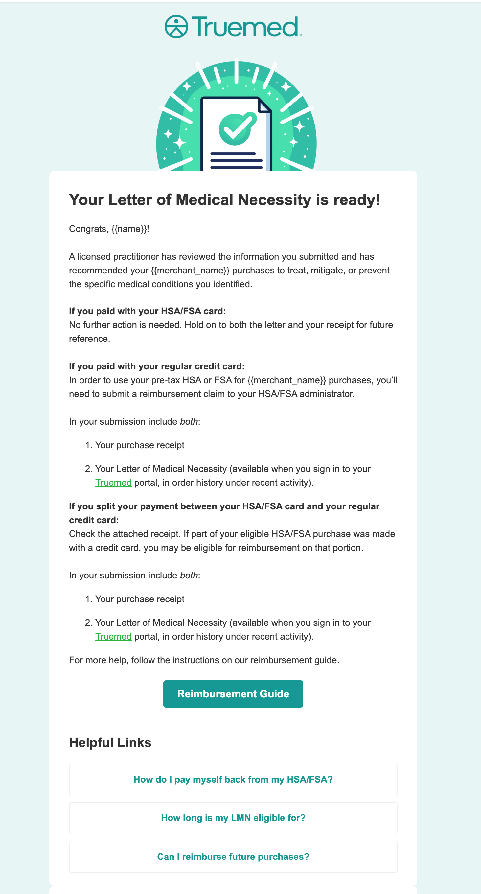
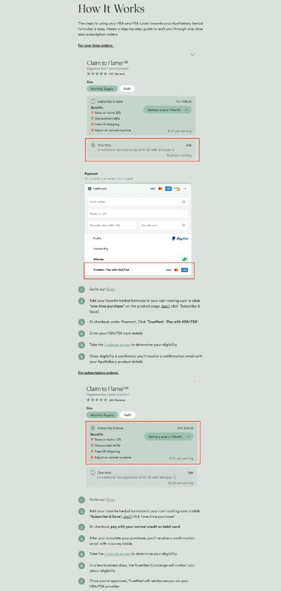

{/* Intercom article ID: 2591425 */}

## Experience the Truemed Checkout Process

**Watch the demo [here](https://app.trupeer.ai/view/OWd75QlwP).**

---
---

## Step 1

Your customers will see our HSA/FSA eligible widget installed on your product/service pages.

---
---

## Step 2

When they click on the **"Learn How"** button, this window will pop up to educate your buyer on how to pay for the product using their HSA/FSA card.

---
---

## Step 3

To make the purchase, your customers will simply select "guest" at checkout **(NOT ShopPay)**, then select "Truemed" as the payment method.

<Note>
While we hope to offer them soon, subscription payments are not eligible for HSA/FSA card payments. If your customer would like to purchase a subscription, they can do so by checking out normally with their regular credit card and submitting for reimbursement.
</Note>

---
---

## Step 4

Your customer clicks **"Place order"** and is redirected to a page that looks like this one:

### 1. Payment details

They are able to pay directly with their HSA/FSA card. If they would like to pay with their regular credit card that is okay too! We will send them instructions for how to manually reimburse with their HSA/FSA administrators.

<Tip>
If a customer does not have adequate funds in their HSA/FSA account, we will prompt them to pay directly with their credit card at checkout, then reimburse up to the amount that is remaining in their account.
</Tip>

### 2. Intake

Your customer takes a 2-minute survey to determine whether or not they qualify to use HSA/FSA products for your specific product.

### 3. Evaluation

One of our medical practitioner partners will review your customer's intake form, then, if approved, will issue a Letter of Medical Necessity to your customer. If they paid with their HSA/FSA card, there is nothing else they need to do except hold onto the letter for 3 years for compliance reasons. If they paid with their regular credit card, we will send them instructions for how to reimburse their purchase with their HSA/FSA administrators.

---
---

## One More Example

We think our partner **"Apothekary"** did a great job of walking their customers through the process of paying with their HSA/FSA dollars, so we included a screenshot from their website here.

