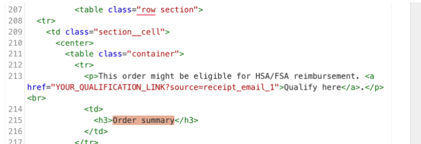
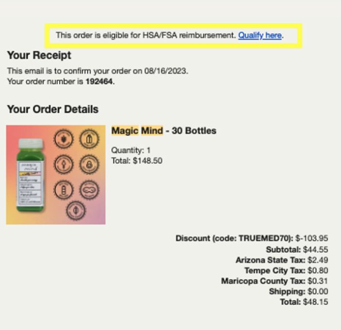
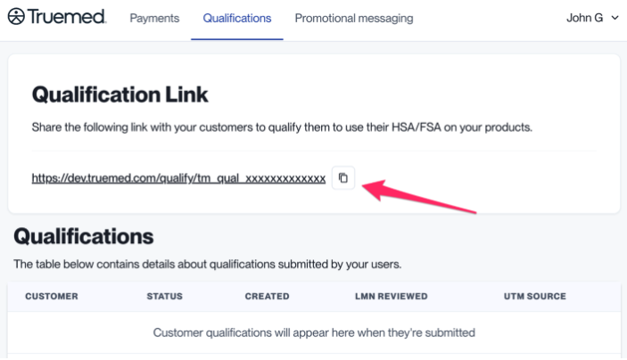

{/* Intercom article ID: 2475329 */}

<Note>
These instructions are specific to reimbursement implementations. They are not necessary to support the Truemed payment app.
</Note>

## Encourage HSA/FSA Reimbursement Immediately Post-Purchase

These instructions will help you include a link to the HSA/FSA reimbursement qualification in the post-purchase email.

For example, an email might look like this:



---
---

## Shopify Instructions

1. Locate your Qualification Link at [app.truemed.com](http://app.truemed.com)

   

   *This is the link that you will copy for the following steps. Make sure to replace `YOUR_QUALIFICATION_LINK` with the link found in step 1.*

2. On your Shopify admin panel, navigate to **Settings** > **Notifications** > **Customer Notifications** > **Order Confirmations** > Click **edit code** > Paste the following code snippet according to where you'd like it to appear in your email template:

```liquid
{}
{}
  {}
  {}
    {}
  {}
{}

<p>This order might be eligible for HSA/FSA reimbursement.<a href="YOUR_QUALIFICATION_LINK?source=receipt_email_1&skus={{{{ skus | url_encode }}}}"> Qualify Here</a></p><br>
```

On the standard Shopify template it could look something like this:



<Tip>
You can click Preview to see what the page will look like before saving it. Note: the hyperlinked text will not be clickable in the preview mode.
</Tip>

---
---

## Non-Shopify Instructions

1. Locate your Qualification Link at [app.truemed.com](http://app.truemed.com)

   

   *This is the link that you will copy for the following steps. Make sure to replace `YOUR_QUALIFICATION_LINK` with the link found in step 1.*

2. Place the following code snippet in your post-purchase email template. Customers have a better experience if you append SKUs to your qualification link.

```html
<p>This order might be eligible for HSA/FSA reimbursement. <a href="YOUR_QUALIFICATION_LINK?source=receipt_email_1">Qualify here</a>.</p><br>
```

---
---

## Need Help?

Contact [merchants@truemed.com](mailto:merchants@truemed.com) for any technical questions about the post-purchase email snippet.
