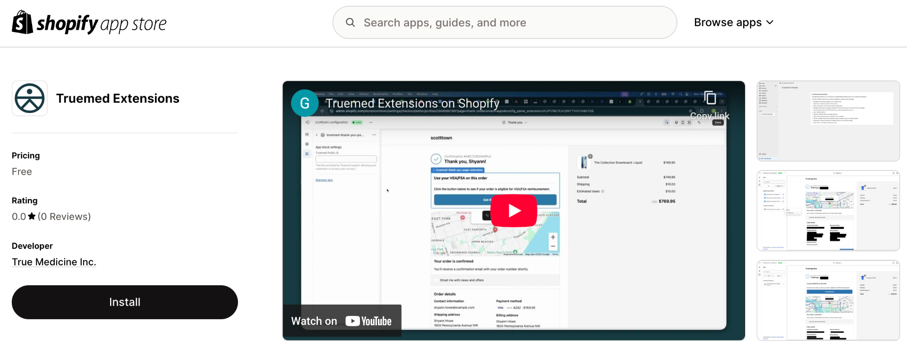
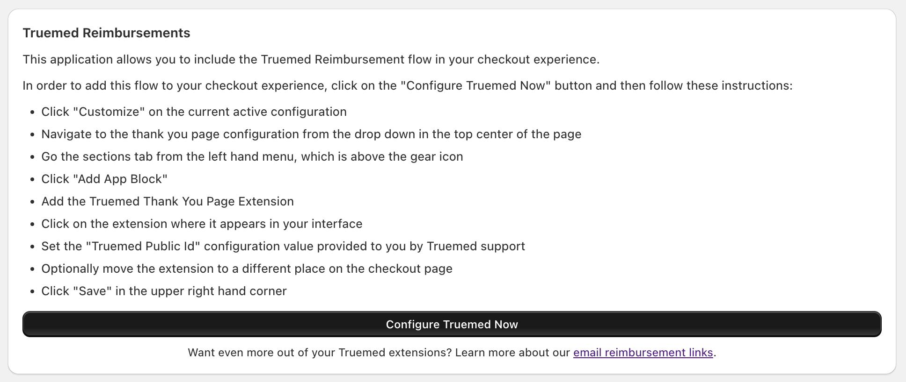
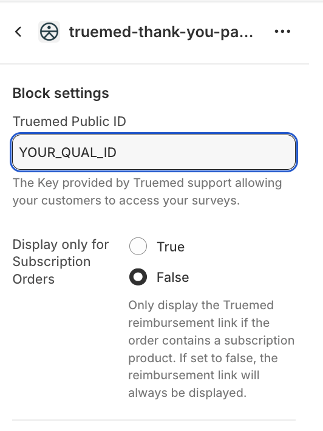
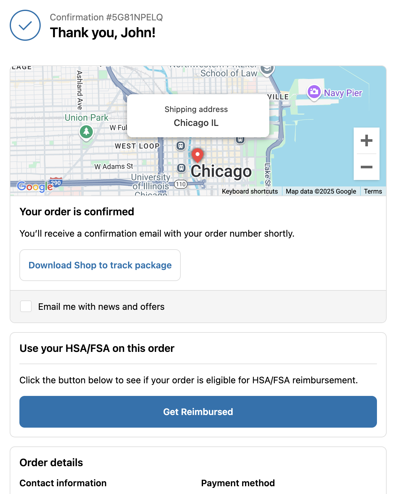

{/* Intercom article ID: 5239361 */}

---
title: Post-Purchase Qualification Link App
subtitle: Install the Truemed Shopify app to display a qualification link on order confirmation pages using Checkout Extensibility.
---

Part of an exemplary Truemed Qualifications implementation includes offering customers a Qualification Link in your store's Order Confirmation page. Previously, this was accomplished by adding a custom code snippet using **"Additional Scripts"**. However, with the launch of **Checkout Extensibility**, this option has been disabled.

<Note>
**What is Checkout Extensibility?** Shopify's Checkout Extensibility is a new framework that enhances customization and security while ensuring compatibility with Shopify's latest updates. Instead of manually inserting scripts, merchants now use checkout extensions and Shopify Functions to customize their checkout experience.
</Note>

Some merchants have already migrated to Checkout Extensibility, while others must enable it by **August 2025 for Shopify Plus** or **August 2026 if not Shopify Plus**.

To support this transition, **Truemed has developed an app** that seamlessly integrates with stores using Checkout Extensibility. Follow the steps below to install Truemed and ensure a smooth setup.

<Tip>
See a loom video created by our engineer, Lucas, to help guide you through the process [here](https://www.loom.com/share/6e01aa4b751f45dd9428f30155bca5b3?sid=757fe96d-2887-4079-b0ba-35a4e64a5c7f).
</Tip>

---

## Installation Steps

1. Visit [Truemed Extensions on Shopify App Store](https://apps.shopify.com/truemed-extensions) and click **Install**

   

2. Click **Install** again

   

3. Follow the instructions provided to **Configure Truemed Now**

   

4. When asked for your **Truemed Public Id**, you can either reach out to [merchants@truemed.com](mailto:merchants@truemed.com) or find it at [app.truemed.com/merchants/qualifications](https://app.truemed.com/merchants/qualifications). Your ID is the last part of your Qualification Link.

   

5. **Save** your changes. The app is now installed! Customers will now find your Truemed Qualification Survey on their Order Confirmation pages.

   

<Note>
To show the qualification link only for subscriptions in the order confirmation, toggle the setting within the checkout extension in the editor.
</Note>

<Warning>
This app does not currently support any customizations, and the Qualification Link will appear on the post-purchase page for all orders.
</Warning>
