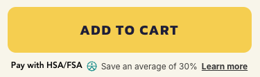
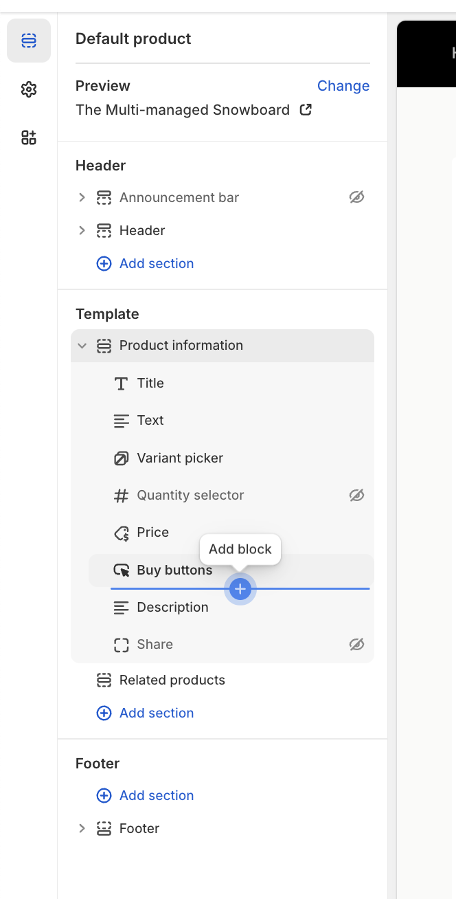

## Overview

This widget educates customers about HSA/FSA eligibility and indicates that they might qualify for HSA/FSA spending or reimbursement with their purchase.

It should be installed on your product pages, typically near the price or "Add to Cart" button:



*Your widget may look different — we are always working on improvements with the goal of increasing conversion.*

---

## Installation

1. Reach out to [merchants@truemed.com](mailto:merchants@truemed.com) if you do not know your **Public Qualification ID**.

2. In Shopify, open the template where you'd like to add the widget. In the left-hand editor, select the section where you want the widget to appear, then click **"Add block"** to insert it.



3. Click **"Add block"**, then insert these 2 lines of HTML on your site, typically near the "Buy" or "Add to Cart" buttons. Make sure to replace `YOUR_PUBLIC_QUALIFICATION_ID` with the ID from Step 1:

```html
<div id="truemed-instructions" style="font-size: 14px;" icon-height="12" data-public-id="YOUR_PUBLIC_QUALIFICATION_ID"></div>
<script src="https://static.truemed.com/widgets/product-page-widget.min.js" defer></script>
```

4. Adjust styles on the div to fit your page. For example:

```html
style="font-size: 16px; margin-top: 7px; margin-bottom: 10px; font-family: Poppins, sans-serif;"
```

---

## Dark Background Implementation

For pages with black or dark backgrounds, add the `dark-mode` attribute to enable a white Truemed logo. Update the text color within the `style` property:

```html
<div dark-mode id="truemed-instructions" style="font-size: 14px; color: #ffffff;" icon-height="12" data-public-id="YOUR_PUBLIC_QUALIFICATION_ID"></div>
<script src="https://static.truemed.com/widgets/product-page-widget.min.js" defer></script>
```

---

## Display on Certain Products Only (Shopify)

<Tip>
To enable this feature, start by tagging your products in your Shopify dashboard. Choose `truemed-eligible` if your store sells fewer eligible products than ineligible. Otherwise, choose `truemed-ineligible` — this is a great option if you have many eligible products but also sell gift cards or branded merch.
</Tip>

**To display only on products tagged `truemed-eligible`:**

```html
<div shopify-tags="display-if-eligible" id="truemed-instructions" style="font-size: 14px;" icon-height="12" data-public-id="YOUR_PUBLIC_QUALIFICATION_ID"></div>
<script src="https://static.truemed.com/widgets/product-page-widget.min.js" defer></script>
```

**To display on all products except those tagged `truemed-ineligible`:**

```html
<div shopify-tags="display-unless-ineligible" id="truemed-instructions" style="font-size: 14px;" icon-height="12" data-public-id="YOUR_PUBLIC_QUALIFICATION_ID"></div>
<script src="https://static.truemed.com/widgets/product-page-widget.min.js" defer></script>
```

---

## Additional Customizations

**1. Change the "Learn how" link color:**

```css
<style>
.truemed-instructions-open {
    color: #7a7a7a !important;
}
</style>
```

**2. Prevent the Truemed logo from oversizing:**

```css
<style>
.truemed-logo-img {
    height: 13px !important;
}
</style>
```

**3. Keep the Truemed logo inline with text:**

```css
<style>
.truemed-logo-img {
    margin: 2px 0 0 3px !important;
}
</style>
```

**4. Add space above or below the widget:**

Add `margin-top: #px;` or `margin-bottom: #px;` to the `style` attribute on the div.

---

## FAQs

**Does this work for Shopify templates?**

Yes. From the Shopify admin panel, navigate to **Online Store > Themes > Actions > Edit Code** and look for your product template (usually called something like `main-product.liquid`). Alternatively, send this page along with your Public Qualification ID to your Shopify developers.

**Does this widget work for both Payment and Reimbursement integrations?**

Yes. Based on your Public Qualification ID, we'll load the product page (PDP) widget custom-tailored to your merchant profile.

---

## Need Help?

Contact [merchants@truemed.com](mailto:merchants@truemed.com) for any technical questions about the product page widget.
