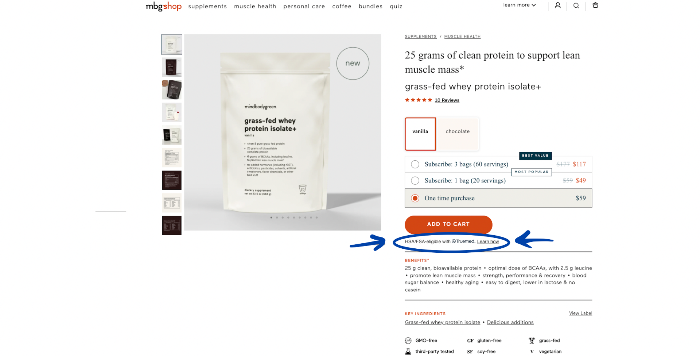
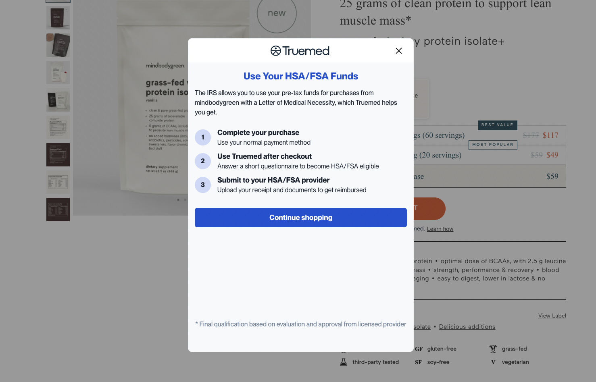
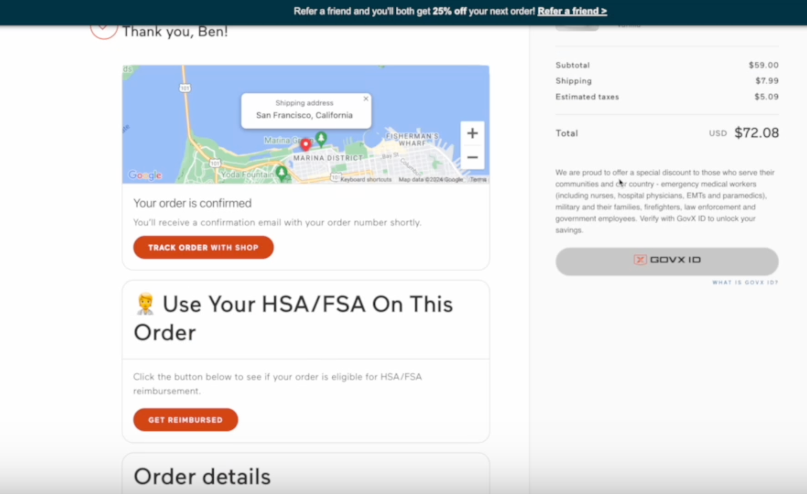
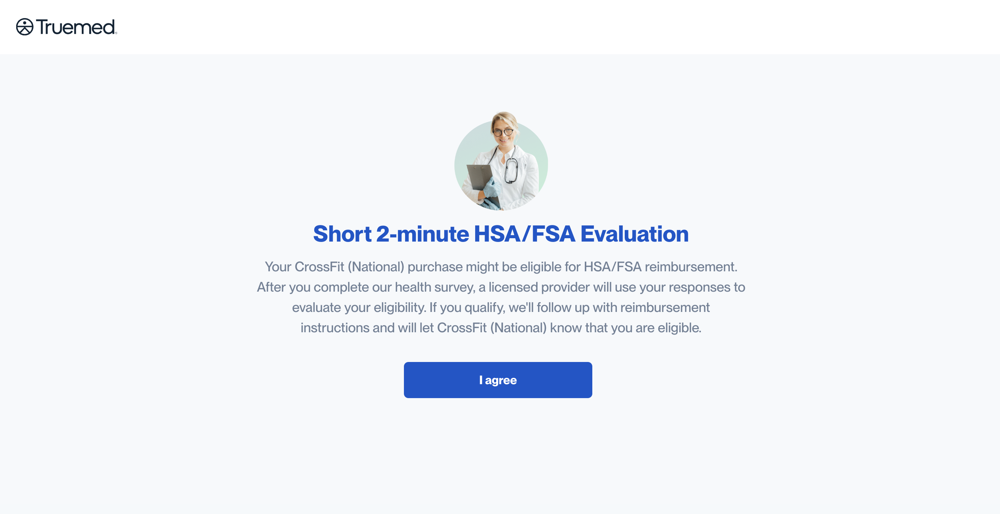
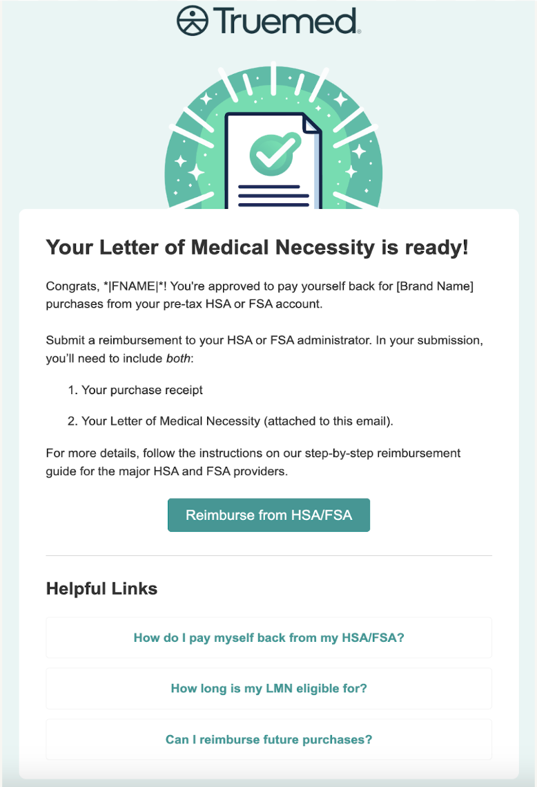

{/* Intercom article ID: 2591489 */}

This checkout method is for our partners who do most of their business through subscription orders, or do not have a Shopify storefront.

---
---

## Experience the Truemed Process

---
---

## Step 1

Your customers will see our HSA/FSA eligible widget installed on your product/service pages.

---
---

## Step 2

When they click on the **"Learn How"** button, this window will pop up to educate your buyer on how to receive reimbursement from their HSA/FSA administrators after purchasing from your site.

---
---

## Step 3

After your customer has checked out with their normal credit card, they will see the below widget embedded on the "order confirmation" page.

---
---

## Step 4

After clicking "get reimbursed" on the order confirmation page, your customer will be prompted to take this HSA/FSA evaluation form to determine eligibility for HSA/FSA reimbursement.

---
---

## Step 5

Once your customer has been pre-approved, one of our independent licensed providers will review their form and, if deemed appropriate, will issue and send over the Letter of Medical Necessity (generally within 24-48 hours). Your customers will receive their LMN in a letter that looks like this, along with instructions on how to reimburse themselves.

