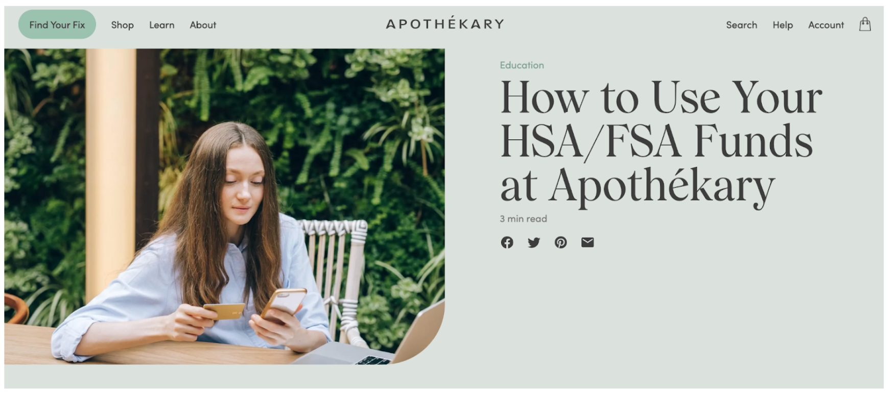
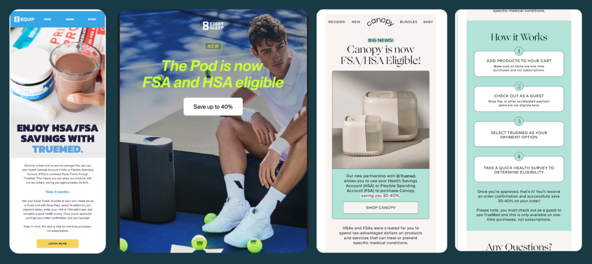
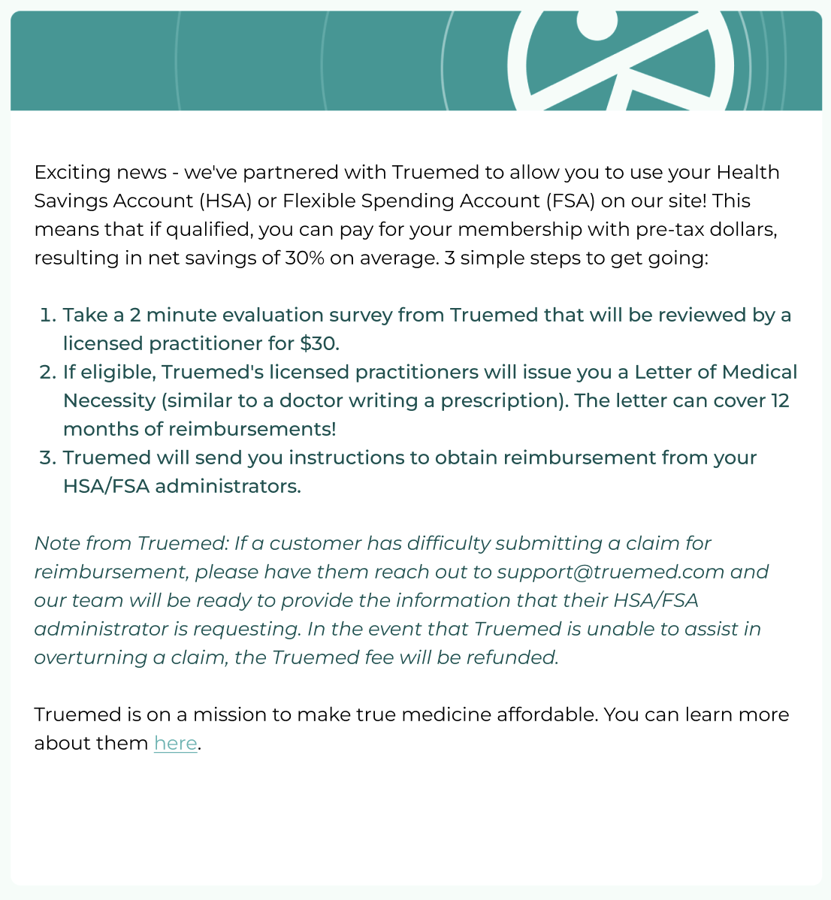
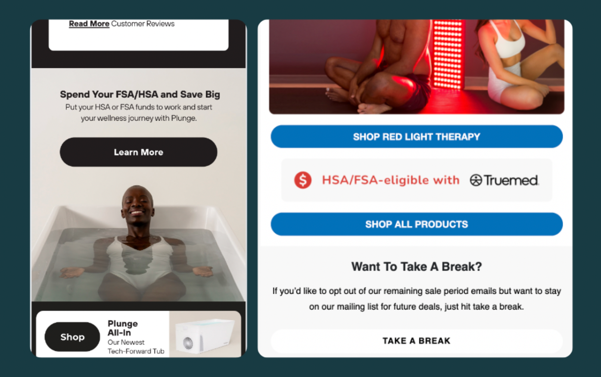
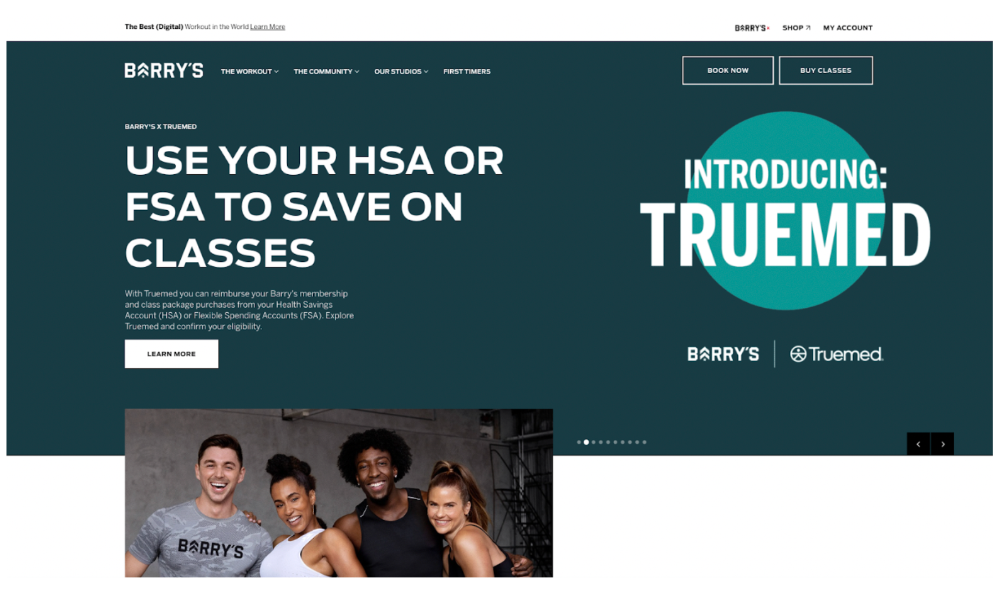
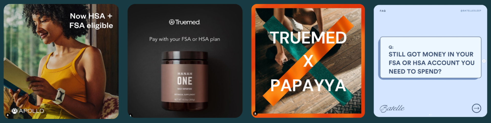
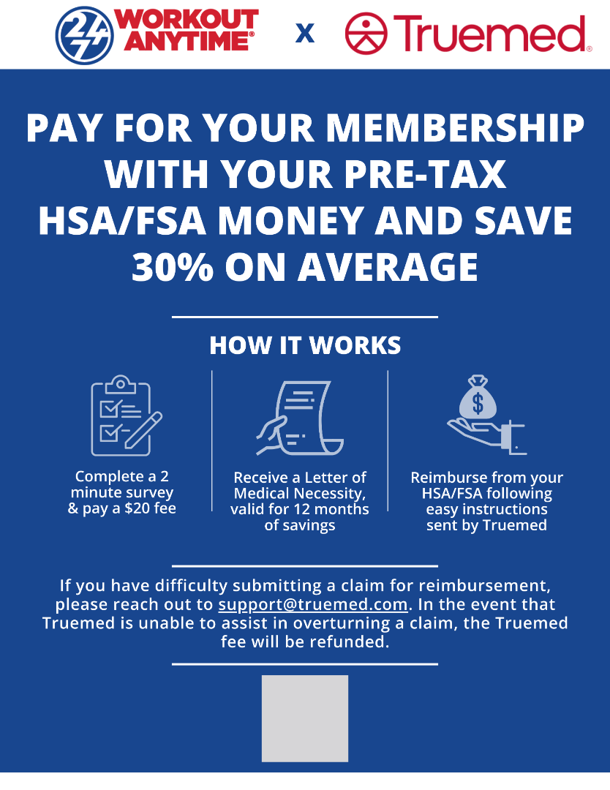

## **HSA/FSA Landing Page**

**How long this should take:**

1 hour

**What you’re doing and why:**

A dedicated landing page explaining how to use HSA/FSA funds for your company's products serves several purposes:

- Funnel traffic from marketing campaigns to the landing page (vs. the homepage) for attribution

- Provide clarity on the purchasing process to increase conversion

- Capture traffic that may be looking for HSA/FSA eligible products in your category

**How to do it:**

We’ve provided a figma file template with suggested copy to make it easy to drop into your own landing page.

*Note: Be sure to include "hsa-fsa" in your landing page URL to maximize SEO*

[**Truemed Landing Page Template**](https://www.figma.com/design/ixu23EnLMBz1QCtyNVR0Lg/D2C-Merchant-Landing-Page-Template?node-id=0-1&p=f&t=4cdWVUL0GHNHFawj-0)
***
## **Emails**

## **Launch Email**

**How long should this take?**

30 minutes

**What you’re doing and why:**

- Inform your current customers  that they may now qualify to use their HSA/FSA funds for purchases. 

- Convert leads who've been on the fence due to price sensitivity

Case studies have shown that open rates and CTRs for this promotional email are typically an order of magnitude higher than standard marketing material.

**Sample Subject Lines**

1. Unlock 30% Savings on Average with HSA/FSA if Eligible: Here's How!

2. Introducing: Use Your HSA/FSA To Save Big On \[Product\] if Eligible

3. Ready to Save 30%? \[Company\] Launches HSA/FSA Payment Option!

**Tips**

- Make sure to include how a customer can use their HSA/FSA, ideally linking to your HSA/FSA landing page with further instructions.

- Be explicit about the potential savings -- 30% on average

**Sample Launch Email**

***
## **Welcome & Renewal Email Footers**

**How long should this take?**

20 minutes

**What you’re doing and why:**

Add a Truemed CTA to the footer of all emails to consistently remind customers of the savings they can enjoy when spending HSA/FSA dollars with you. 

**How to do it:**

Copy and paste the below text into the footer of existing marketing emails.

> Get reimbursed an average of 30% for the next year on your \[Merchant Name\] membership using your HSA/FSA. To get started, take a 2 minute survey and pay a $30 fee: Qualify for HSA/FSA Spending \[CTA linking your survey link\]
***
## **Website** 

## **Homepage Feature**

**How long should this take?**

30 minutes

**What you’re doing and why:**

Stand out as a leader in the health and wellness space all while helping your customers save on their purchases. Featuring your partnership with a homepage block ensures that customers are aware of this payment option, and can quickly navigate them to shop for  HSA/FSA eligible products.

**How to do it:**

Add the following copy to a content block on your website’s homepage. 

[table]

## **Banner on Pricing Pages**

**How long should this take?**

20 minutes

**What you’re doing and why:**

Sharing the savings benefit on pricing pages can help convert price sensitive new members, improve retention, and help to encourage greater spend by current members (by giving them more buying power!).

**How to do it:**

Add the following copy to a content block on your website’s membership/pricing page. 

If you do **not** have an [HSA/FSA landing page](/service-business/marketing-playbook-a-successful-launch):

[table]

If you have an [HSA/FSA landing page](/service-business/marketing-playbook-a-successful-launch):

[table]
***
## **Launch Social Post & Story**

**How long should this take?**

30 minutes

**What you’re doing and why:**

Leverage promotion on social media to inform, educate, and convert your audience with the new HSA/FSA payment option. 

**How to do it:**

Copy & paste this caption into your post on social media. Tag us (@truemedpayments) in your post and we will do our best to re-share. With Truemed co-marketing alongside your brand, you can reach a broader health-focused audience.

> Exciting news! We’ve partnered with [@truemedpayments](https://www.instagram.com/truemedpayments/) to allow you to use your Health Savings Account (HSA) or Flexible Savings Account (FSA) to reimburse your \[Merchant Name\] membership, if eligible!
>
> That means shopping with pre-tax dollars, resulting in a net savings of 30% on average for you.
>
> The process is simple.
>
> 1. Take a 2 minute evaluation survey from Truemed that will be reviewed by a licensed practitioner for $30. 
>
> 2. If eligible, Truemed's licensed practitioners will issue you a Letter of Medical Necessity (similar to a doctor writing a prescription). The letter can cover 12 months of reimbursements!
>
> 3. Truemed will send you instructions to obtain reimbursement from your HSA/FSA administrators.
>
> Go to \[insert FAQ or Landing Page Link\] for more information!

**Resources:**

- [Favorite posts from partner brands](https://app.frontapp.com/cell-00020/api/1/companies/43b8141155d02d812a87/knowledge_bases/18113/preview/articles/2488961?previewMode=draft&locale=en)

- [Compliant language guide](https://support.truemed.com/en/articles/2489153)
***
## **In-App Push Notification**

## **How long should this take?**

15 minutes

**What you’re doing and why:**

Stand out as a leader in the health and wellness space all while helping your customers save on their purchases. Spread the news of HSA/FSA reimbursement with an announcement in your app.

**How to do it:**

Add the following copy to a content block on your website’s homepage. 

> Get reimbursed an average of 30% for the next year on your \[Merchant Name\] membership using your HSA/FSA. To get started, take a 2 minute survey and pay a $30 fee: Qualify for HSA/FSA Spending \[CTA linking your survey link\]
***
## **In-Studio QR Code Flyer**

**How long should this take?**

45 minutes

**What you’re doing and why:**

Make it easy for customers in-studio to easily obtain a Letter of Medical Necessity with a QR code flyer.

**Example Flyer:**

**How to create:**

Create your own QR code by adding your unique survey link url [here](https://new.express.adobe.com/tools/generate-qr-code?referrer=https%3A%2F%2Fwww.google.com%2F&url=%2Fexpress%2Ffeature%2Fimage%2Fqr-code-generator&placement=floating-button&locale=en-US&contentRegion=us&%24web_only=true&_branch_match_id=1009544438788962985&_branch_referrer=H4sIAAAAAAAAAyWOwWrDMBBEvya6yYaWXAqilELJLZDQc1nJY9lE1qqrNeqp3x6FwMAbhhmYRbXUt3GkiT1qIbkVrmob%2FEClDGnNtxEj0YTlej4dT%2F5dMEME4pbH9PD6cXj56mqtDZE5JgyBtx6YXZLrxF8R1NrdDNJd0N26UXzwV2zgCTYiQ0hZTEkUsCGrmxOTrjlav6tyNokDJThk%2B301gbP20gVx5ez2av6ft3r%2Fxwu32v99LsIb7uMKF0fhAAAA).

If you [order prints](https://www.vistaprint.com/marketing-materials/flyers), select "vertical" for orientation; then for size, select 4.2" x 5.5".

