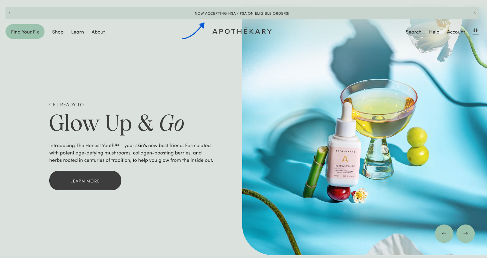
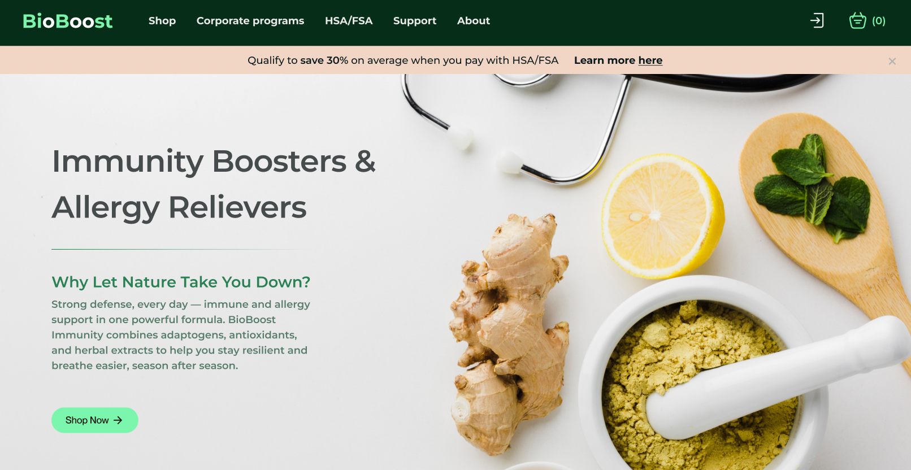

## **Year-Round Banner Copy:**

Using the tools you built your site with, create a banner at the top of your homepage and paste in the text below. Link the CTA to your Truemed Survey Link or landing page.

> HSA/FSA Eligible: Learn more.\*

or

> Qualify to save an average of 30% when you pay with HSA/FSA: Learn More.\*

**Important:** Please include our compliance disclaimer on any HSA/FSA messaging:

> \*Truemed is for qualified customers. HSA/FSA tax savings vary. Learn more at [truemed.com/disclosures](https://docs.google.com/document/d/19Cxl1ZbXTX25_44rZ8Mbj3nKfsuzmHVOXm7uYuVKewk/edit?tab=t.0#heading=h.8fnbt71wtlyg)

For site banners, you can include the disclaimer just above your footer navigation. If the disclaimer is missing, we may ask you to update or remove the asset. 

# **Seasonal Banner Copy**

## **Open Enrollment (Sept–Nov)**

**Sample Banner Copy:**

- It’s open enrollment season: max out your HSA/FSA contribution to save an average of 30%\*

- Use your HSA/FSA funds to invest in your health this year\*

- Planning your 2026 benefits? Qualified customers can pay with HSA/FSA\*

- Save an average of 30% when you qualify to use HSA/FSA funds\*

- Use HSA/FSA funds on eligible products\*

**Important:** Please include our compliance disclaimer on any HSA/FSA messaging:

> \*Truemed is for qualified customers. HSA/FSA tax savings vary. Learn more at [truemed.com/disclosures](https://docs.google.com/document/d/19Cxl1ZbXTX25_44rZ8Mbj3nKfsuzmHVOXm7uYuVKewk/edit?tab=t.0#heading=h.8fnbt71wtlyg)

For site banners, you can include the disclaimer just above your footer navigation. If the disclaimer is missing, we may ask you to update or remove the asset. 
***
## **End-of-Year / FSA Expiration (Dec)**

**Sample Banner Copy:**

- Don’t let your FSA funds expire—shop eligible products today\*

- Use it or lose it: Most FSA funds expire December 31\*

- Still have FSA funds? Use them before the year ends\*

- Save an average of 30%—use your FSA funds before they’re gone\*

**Important:** Please include our compliance disclaimer on any HSA/FSA messaging:

> \*Truemed is for qualified customers. HSA/FSA tax savings vary. Learn more at [truemed.com/disclosures](https://docs.google.com/document/d/19Cxl1ZbXTX25_44rZ8Mbj3nKfsuzmHVOXm7uYuVKewk/edit?tab=t.0#heading=h.8fnbt71wtlyg)

For site banners, you can include the disclaimer just above your footer navigation. If the disclaimer is missing, we may ask you to update or remove the asset. 
***
## **New Year, New You (Jan–Feb)**

**Sample Banner Copy:**

- New Year's Resolutions? Invest in your health goals and save an average of 30% with HSA/FSA\*

- Start the year strong—use HSA/FSA funds to save an average of 30%\*

- Invest in your health goals and save an average of 30% with HSA/FSA if eligible\*

- Use your HSA/FSA funds to support your 2025 health resolutions\*

- New Year, New You: Save an average of 30% with HSA/FSA funds\*

**Important:** Please include our compliance disclaimer on any HSA/FSA messaging:

> \*Truemed is for qualified customers. HSA/FSA tax savings vary. Learn more at [truemed.com/disclosures](https://docs.google.com/document/d/19Cxl1ZbXTX25_44rZ8Mbj3nKfsuzmHVOXm7uYuVKewk/edit?tab=t.0#heading=h.8fnbt71wtlyg)

For site banners, you can include the disclaimer just above your footer navigation. If the disclaimer is missing, we may ask you to update or remove the asset. 

### **
Compliance Reminder**

Following Truemed’s compliance guidelines protects customers from misleading claims and keeps your brand aligned with IRS/HSA/FSA rules, reducing the risk of ad rejections or takedowns. It also preserves trust and lowers the chance of disputes or chargebacks by setting accurate expectations about eligibility and savings.

Please include our compliance disclaimer on any HSA/FSA messaging:

> \*Truemed is for qualified customers. HSA/FSA tax savings vary. Learn more at [truemed.com/disclosures](https://docs.google.com/document/d/19Cxl1ZbXTX25_44rZ8Mbj3nKfsuzmHVOXm7uYuVKewk/edit?tab=t.0#heading=h.8fnbt71wtlyg)

If the disclaimer is missing or if your ad copy is misleading, incomplete, or otherwise non-compliant with the law or your agreement with Truemed, we may ask you to update or remove the asset. If you’d like our team to review marketing assets prior to go-live, email us at [merchants@truemed.com](mailto:merchants@truemed.com).

Need more guidance on what you can say about HSA/FSA? Review the [**Compliant HSA/FSA Messaging Guide**](https://support.truemed.com/resources/compliant-hsa-fsa-messaging) and remember to add our required disclaimer with any savings claims.

Need help reviewing your banner copy? Email us at [merchants@truemed.com](mailto:merchants@truemed.com).

