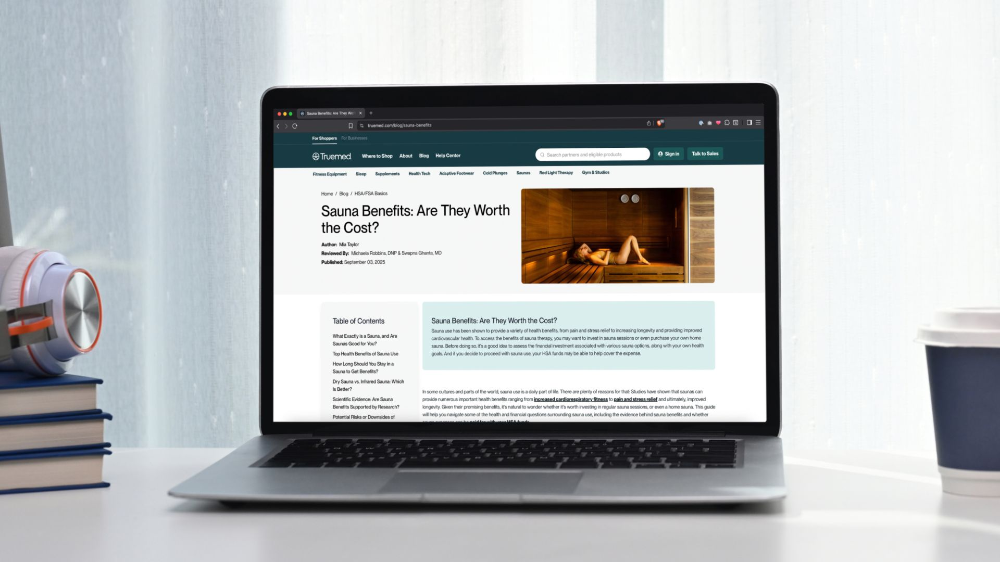
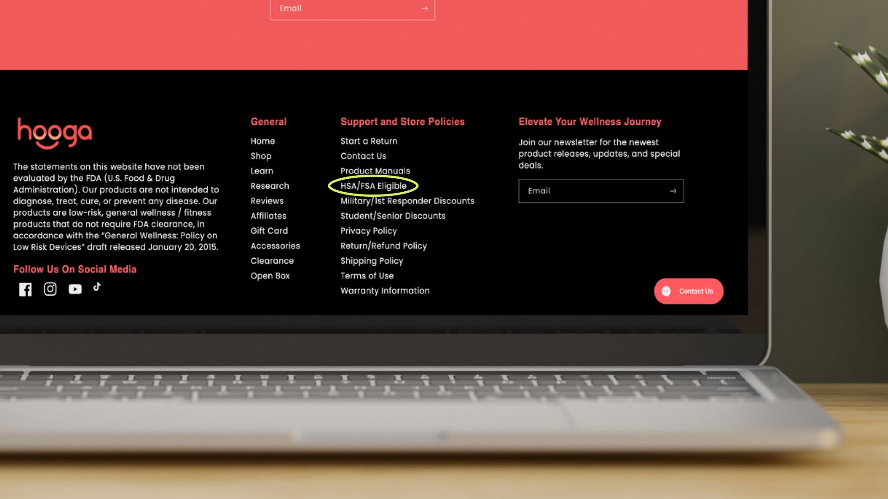

## **Making Sure Your Landing Page is SEO Optimized**

Want more traffic to your page—and in turn, more conversion? Follow this basic guide to help search engines understand your page and get more shoppers:

## **SEO Essentials**

- URL = When building a page, use a short URL that includes the keyword and is &lt;60 characters. Use hyphens to separate words, and keep the whole thing between 1-5 words. (Eg. )

- SEO Title = Add a title tag ≤60 characters with the target keyword (Best Red Light Therapy Devices)

- Meta Description = Add a 130-140-character meta description that answers the main question. (“Shop HSA/FSA-eligible red light therapy devices for skin, pain relief & muscle recovery at Truemed.”)

Another example:

- **SEO Title:** \[Brand\] HSA/FSA Eligible Products

- **URL:** /hsa-fsa-eligible-products/

- **Meta:** Buy HSA/FSA eligible items on \[Brand\]. Take a 2-minute health check with Truemed, then pay pre-tax and save \~30% on your purchase.

- Other Suggested Titles: 

  - HSA/FSA eligible items at \[Brand\]

  - Is \[Brand\] HSA/FSA Eligible?

  - How to Use Your HSA/FSA Card at \[Brand\]

  - How to Save with HSA/FSA Funds at \[Brand\]

  - Use Your HSA/FSA Card To Save an average of 30% on \[Brand\]

## **Answer The Main Question Above The Fold**

“**Above the fold**” means what shoppers see without scrolling, which includes the header image, H1 (headline) with the keyword, and sometimes a one-liner statement/answer about the page. Here are a couple examples with varying levels of detail.

### **Here’s a sample format:**

- **H1:** HSA/FSA eligible items at \[Brand\]

  - Each webpage should only have one H1 per page

- **Subheadings (H2/H3/H4 and so on)**

  - Here are possible subtopics

    - What is HSA/FSA?

    - How Truemed Works

    - HSA/FSA Eligible Items

    - FAQ

- \[Brand\] accepts HSA/FSA eligible items purchases through Truemed.

  - Other samples:

    - Use your HSA/FSA on eligible \[Brand\] items via Truemed.

    - HSA/FSA is available at \[Brand\] for qualifying items through Truemed.

    - Buy qualifying \[Brand\] purchases that are HSA/FSA-eligible with Truemed.

    - \[Brand\] supports HSA/FSA payments on eligible items via Truemed.

## **Add A Small FAQ Section**

An FAQ section provides added service to your customers by answering common questions. It helps shoppers quickly find information, which can improve their likelihood to click and buy. Plus, it can improve how your page appears in search. Five to seven questions tends to be a good “sweet spot” to provide info without overwhelm.

**Find FAQs to add to your page within our [Landing Page Templates](/resources/hsa-fsa-landing-page).**

## **Add Internal Links To Your Landing Page**

Internal links are links from your own site to this page. This helps users and search engines find this page.

**How to do it:**

- Add a link to the **main navigation** and/or **footer**.

- Link from relevant **product pages/collections/articles**.

- Link from **newsletters/social/campaigns** when talking about FSA/HSA, savings, or benefits.

## **Add A Link Back to Truemed**

A short line that shows Truemed powers the flow, with a backlink to Truemed. This builds trust for shoppers and connects your page to an authoritative resource. The link should not be marked as sponsored or no-follow.

