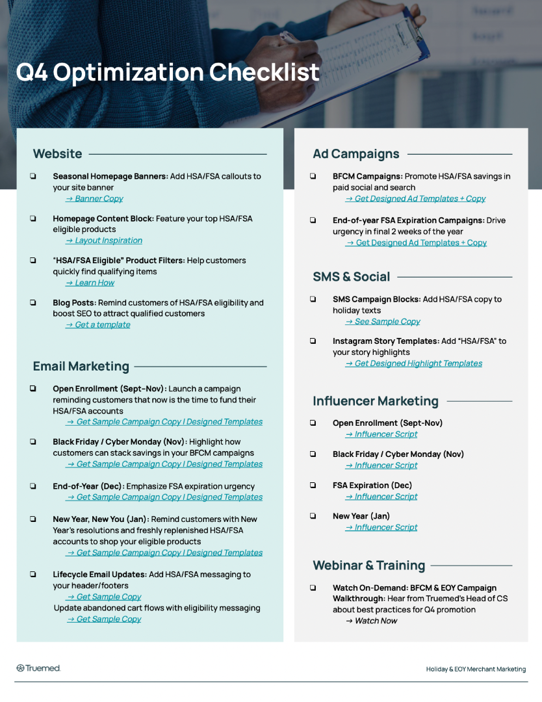

{/* Intercom article ID: 7222593 */}

## Why Q4 Is Your Biggest Revenue Opportunity

The end of the year brings three major revenue drivers: Open Enrollment, Black Friday/Cyber Monday, and the FSA deadline. Open Enrollment in the fall is a key moment to educate shoppers as they fund new HSA/FSA accounts. BFCM kicks off peak holiday buying behavior, and FSA funds must be used by December 31, creating urgency that drives a surge in tax-free spending across the final weeks of the year.

And it doesn't stop in December -- January brings a fresh wave of opportunity as customers start the year with replenished HSA/FSA funds and health-focused resolutions. Brands that maintain momentum into Q1 can capture early-year spend with "new year, new you" messaging and smart remarketing.

Below, you'll find copy suggestions & templates for HSA/FSA messaging at each key seasonal opportunity.

## Download the Q4 Optimization Checklist

<Tip>
Download the [**Q4 Optimization Checklist (PDF)**](https://usw2.frontkb-cdn.com/attachments/8032212/18113/9e5222dc-5928-4f31-bbcf-1c343056b0da.pdf) for a printable version of everything below.
</Tip>

---
---

## Site Optimization

- **Seasonal Homepage Banners**
  - Add HSA/FSA callouts to your site banner
  - [Banner Copy](https://support.truemed.com/resources/seasonal-site-banners)

- **Homepage Content Block**
  - Feature your top HSA/FSA eligible products
  - [Layout Inspiration](https://support.truemed.com/resources/seasonal-homepage-feature)

- **"HSA/FSA Eligible" Product Filters**
  - Help customers quickly find qualifying items
  - [Learn How](https://support.truemed.com/resources/add-hsa-fsa-eligible-filters-or-badges-to-your-products)

- **Blog Posts**
  - Remind customers of HSA/FSA eligibility and boost SEO to attract qualified customers
  - [Get a template](https://support.truemed.com/resources/hsa-fsa-blog-post)

---
---

## Email Marketing

- **Open Enrollment (Sept-Oct)**
  - Launch a campaign reminding customers that now is the time to fund their HSA/FSA accounts
  - [Get Sample Campaign Copy | Designed Templates](https://support.truemed.com/resources/open-enrollment-overview-and-email-campaign-templates)

- **Black Friday / Cyber Monday (Nov)**
  - Highlight how customers can stack savings in your BFCM campaigns
  - [Get Sample Campaign Copy | Designed Templates](https://support.truemed.com/resources/bfcm-email-templates)

- **End-of-Year (Dec)**
  - Emphasize FSA expiration urgency
  - [Get Sample Campaign Copy | Designed Templates](https://support.truemed.com/resources/fsa-expiration-email-templates)

- **New Year, New You (Jan)**
  - Remind customers with new years resolutions and freshly replenished HSA/FSA accounts to shop your eligible products
  - [Get Sample Campaign Copy | Designed Templates](https://support.truemed.com/resources/new-year-new-you-email-templates)

- **Lifecycle Email Updates**
  - Add HSA/FSA messaging to your header/footers -- [Get Sample Copy](https://support.truemed.com/resources/hsa-fsa-headers-and-footers-2)
  - Update abandoned cart flows with eligibility messaging -- [Get Sample Copy](https://support.truemed.com/resources/abandoned-cart-updates)

---
---

## Ad Campaigns

- **BFCM Campaigns**
  - Promote HSA/FSA savings in paid social and search
  - [Get Designed Ad Templates + Compliant Copy](/resources/hsa-fsa-ad-templates-for-bfcm-and-year-end-promotions)

- **End-of-year FSA Expiration Campaigns**
  - Drive urgency in final 2 weeks of the year
  - [Get Designed Ad Templates + Compliant Copy](/resources/hsa-fsa-ad-templates-for-bfcm-and-year-end-promotions)

---
---

## SMS & Social

- **SMS Campaign Blocks**
  - Add HSA/FSA copy to holiday texts
  - [See Sample Copy](https://support.truemed.com/resources/seasonal-sms-campaigns)

- **Instagram Story Templates**
  - Add "HSA/FSA" to your story highlights
  - [Get Designed Highlight Templates](https://support.truemed.com/resources/social-media-highlight-templates)

---
---

## Influencer Marketing

- **Open Enrollment (Sept)** -- [Influencer Script Template](https://support.truemed.com/resources/influencer-scripts#open_enrollment_influencer_script)
- **Black Friday / Cyber Monday** -- [BFCM Script](https://support.truemed.com/resources/influencer-scripts#bfcm_influencer_script_stack_your_savings)
- **End-of-Year** -- [EOY Script](https://support.truemed.com/resources/influencer-scripts#fsa_expiration_influencer_script_what_you_need_to_know_before_dec_31)

---
---

## Webinars & Training

- **Watch On-Demand: BFCM & EOY Campaign Walkthrough**
  - Hear from Truemed's Head of CS, Chantel Hopper, about best practices for Q4 promotion
  - [Watch Now](https://support.truemed.com/resources/watch-our-q4-webinar-2)
