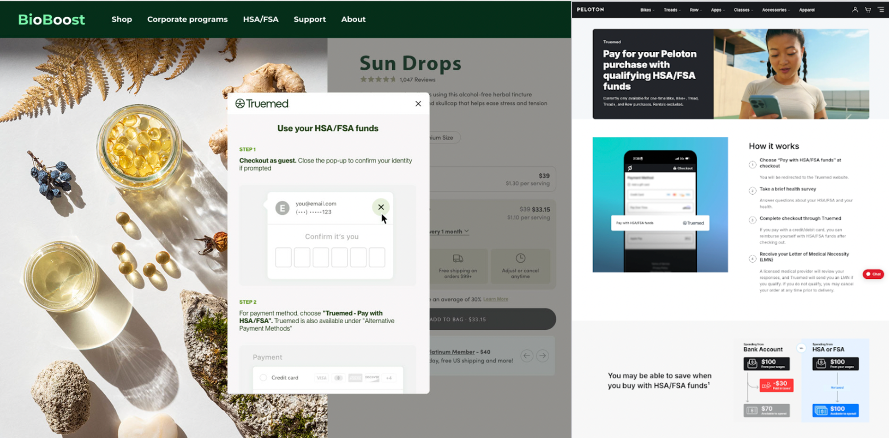

{/* Intercom article ID: 7543425 */}

Follow this step-by-step guide to optimizing your Truemed partnership.

---
---

## Website Optimization

- [ ] **Create an [HSA/FSA Eligible Product Collection](/resources/hsa-fsa-eligible-product-collections)**

- [ ] **Create a High-Converting Landing Page**
  - Use our [**Landing Page Guide**](/resources/hsa-fsa-landing-page) to design a page that drives conversions.
  - Access our [**Figma Template**](/resources/hsa-fsa-landing-page#figma_file_templates) to simplify the creation process.

- [ ] **Ensure the [PDP Widget](https://support.truemed.com/resources/product-page-widget-2) and [Truemed Payment App](https://support.truemed.com/resources/checkout-integration) are Installed**

- [ ] **Add a [Banner](/resources/homepage-banner) to your Homepage announcing HSA/FSA eligibility**

- [ ] **[Update FAQs](/resources/faq-page-updates) on your site to answer questions about HSA/FSA eligibility**

- [ ] **Add [Checkout Messaging](/resources/checkout-messaging-for-subscription-products) for Subscription Products**

---
---

## Launch Promotion

- [ ] **Send a [Launch Email](https://support.truemed.com/resources/launch-email) announcing the partnership**

- [ ] **Test [HSA/FSA Paid Ads](/resources/paid-ads-unlocking-revenue-potential) (consistently reported by our partners to be their top performing paid advertising)**

- [ ] **If you use [SMS marketing](/resources/drive-more-hsa-fsa-sales-with-sms), use our templates to spread the news about HSA/FSA savings**

- [ ] **Add a [social story highlight](https://support.truemed.com/resources/social-media-highlight-templates) about HSA/FSA eligibility (use our copy and/or pre-designed templates to make it easy!)**

- [ ] **Grab [caption copy](/resources/social-channels) for your social post announcement**

- [ ] **Review [Seasonal HSA/FSA Messaging Resources](/resources/the-q4-opportunity-and-optimization-checklist)**
