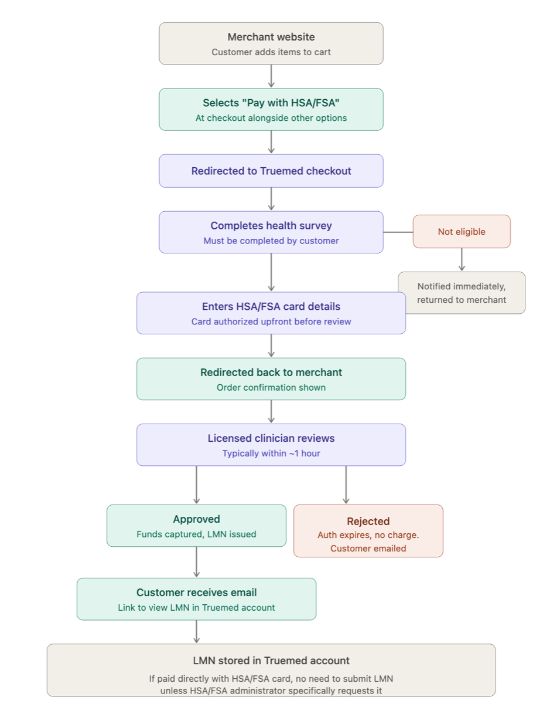
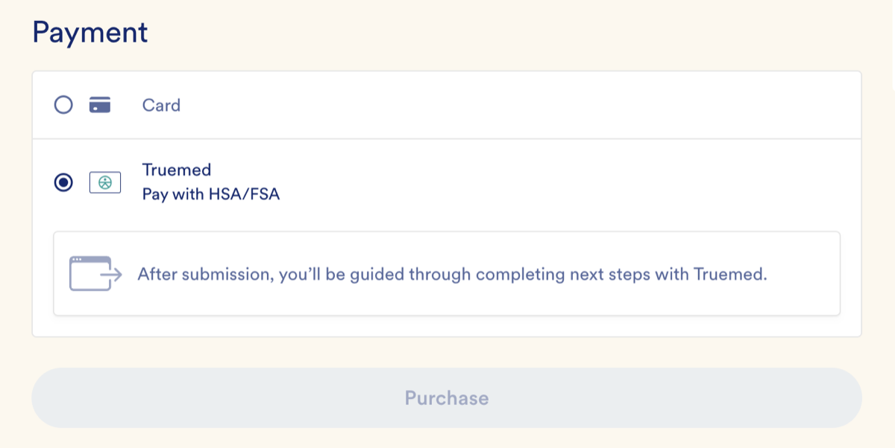
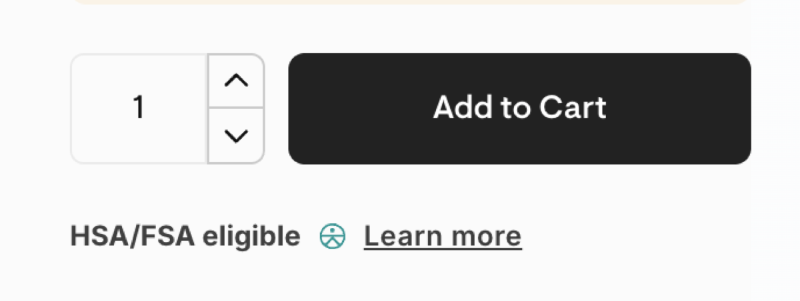

This guide walks you through implementing Truemed directly via our API. It's written for merchants on custom or non-standard commerce platforms; if you're on Shopify or WooCommerce, use the platform-specific integration instead. By the end, you'll know what to build, how the payment flow works end-to-end, and how to test before going live.

***

## What You'll Need Before Starting

Before you begin, your team should have:

- **A Truemed sandbox account.** Your Solutions Engineer provisions this for you. The sandbox lets you run end-to-end test transactions without touching real HSA/FSA cards.
- **A Truemed sandbox API key.** Create one at [dev.truemed.com/developers/api-keys](https://dev.truemed.com/developers/api-keys) after logging into the sandbox admin.
- **A webhook endpoint.** Truemed sends webhooks to your server to communicate the outcome of each transaction. You'll register the URL for this endpoint in the Truemed sandbox admin.
- **Engineering capacity.** Scope depends on your existing checkout architecture. Your Solutions Engineer can give you a timeline estimate based on your stack.

<Note>
If you restrict inbound traffic by source IP, ask your Solutions Engineer for the Truemed IP allowlist so our webhooks don't get blocked at your edge.
</Note>

***

## How a Truemed Transaction Works

Here's the full lifecycle of one HSA/FSA transaction, from product page to fulfillment.

1. The shopper sees a Truemed payment widget on your product page that educates them about HSA/FSA eligibility.
2. At checkout, the shopper selects "Pay with HSA/FSA (Truemed)" alongside your other payment methods.
3. Your system calls Truemed's `create_payment_session` endpoint with the cart contents and customer info. Truemed returns a `redirect_url`.
4. You redirect the shopper to the hosted Truemed checkout. The shopper completes a clinical intake form and, if eligible, enters their HSA/FSA card. Truemed places an authorization hold on the card (not a capture).
5. The session status changes to `processing`. Show the shopper an order-placed confirmation, but do not fulfill yet.
6. An independent licensed practitioner reviews the intake and determines whether to issue a Letter of Medical Necessity (LMN).
7. Truemed sends a webhook to your server with the result:
   - **`captured`:** The LMN was issued and Truemed captured the funds. Fulfill the order.
   - **`rejected`:** The LMN was not issued. The authorization hold will expire. Cancel the order and notify the shopper.

<Note>
Truemed authorization holds are valid for 6.95 days and are not re-authorized once they expire. In the rare case that practitioner review runs past that window, the order will be canceled even if the LMN is later approved.
</Note>

***

## What You Need to Build

Implementing the flow above requires five concrete pieces of work on your side. Each is independent enough that different team members can own different pieces.

### 1. Add the Truemed Payment Option to Your Checkout

Add "Pay with HSA/FSA" as a payment method alongside your existing options (credit card, PayPal, and so on). Selecting it should kick off step 3 below.

### 2. Add the Truemed Payment Widget to Your Product Page

The widget educates shoppers about HSA/FSA eligibility before they reach checkout and indicates that they may qualify for HSA/FSA spending or reimbursement on the product. Truemed provides the widget as a snippet you embed on product pages where eligibility applies.

### 3. Call `create_payment_session` When the Shopper Selects Truemed at Checkout

When the shopper clicks "Pay with HSA/FSA," your backend calls the [`create_payment_session`](https://developers.truemed.com/api-reference/payment-sessions/create-payment-session) endpoint with the cart line items, total, customer info, and your `success_url` and `failure_url`. Truemed returns a `redirect_url` for the hosted checkout.

| Environment | Base API URL |
| --- | --- |
| Sandbox | `https://dev-api.truemed.com/` |
| Production | `https://api.truemed.com/` |

### 4. Redirect the Shopper to the Hosted Truemed Checkout

Send the shopper to the `redirect_url` returned in step 3. Truemed handles the clinical intake form, eligibility decision, and card authorization. After completion, the shopper is redirected back to your `success_url` or `failure_url`.

### 5. Listen for Webhooks From Truemed

Stand up an HTTPS endpoint that accepts `POST` requests from Truemed. Treat the webhook as the source of truth for whether an order can be fulfilled. Never fulfill based on the redirect alone. The relevant event is `payment_session.completed`. See the [Webhooks guide](https://developers.truemed.com/guides/resources/webhooks) for full details on signature verification, retries, and idempotency.

<Tip>
Use signed webhooks. They're tamper-evident, include a built-in idempotency key (`webhook_delivery_id`), and only take a few lines of code to verify.
</Tip>

***

## Subscriptions and Recurring Billing

If you sell subscriptions, Truemed supports partner-managed recurring billing through the `payment_token` product. There are two approaches depending on the customer:

- **New subscribers.** Call `create_payment_session` with `tokenize=True`. The initial order is processed and a reusable payment token is provisioned in the same flow.
- **Existing subscribers.** Call `create_payment_token` to provision a token for a customer who already has an active subscription with you.

In either case, Truemed sends the `payment_token.updated` webhook once the token is ready to be used for subsequent billing periods. See the [Subscriptions overview](https://developers.truemed.com/guides/subscriptions/overview) for the full implementation.

***

## Sandbox Testing

Run end-to-end test transactions in sandbox before promoting your integration to production.

| Resource | URL |
| --- | --- |
| Sandbox admin | [dev.truemed.com](https://dev.truemed.com/) |
| Create sandbox API key | [dev.truemed.com/developers/api-keys](https://dev.truemed.com/developers/api-keys) |
| Configure sandbox webhook URLs | [dev.truemed.com/developers/webhooks/manage](https://dev.truemed.com/developers/webhooks/manage) |

**To get started:**

1. Log into the [sandbox admin](https://dev.truemed.com/) with the email your Solutions Engineer set up for you. Click "Need to set or reset a password?" on first login.
2. Invite the rest of your engineering team via the Settings page.
3. Generate a sandbox API key and store it as an environment variable in your application.
4. Register your sandbox webhook URL.
5. Run a full test transaction: product page widget, checkout selection, hosted Truemed flow, webhook delivery, fulfillment.

The Sandbox Testing Guide walks through test cases for the various LMN approval and rejection outcomes you'll want to cover before going live.

<Note>
If you restrict inbound traffic by source IP, add Truemed's webhook source IPs to your allowlist before testing. Your Solutions Engineer can provide the current list.
</Note>

***

## Going Live

Once your sandbox integration is complete and your team has run through the end-to-end test cases, the Truemed team will run validation transactions on our side to confirm the integration is behaving correctly. After both teams sign off, your Solutions Engineer will help you promote to production:

1. Generate a production API key in the production Truemed admin at [app.truemed.com](https://app.truemed.com/)
2. Register your production webhook URL
3. Swap the base API URL from `dev-api.truemed.com` to `api.truemed.com` in your application config
4. Run a small live transaction with a real HSA/FSA card to verify the full flow end-to-end
5. Roll out to all eligible products

***

## Need Help?

Email [merchants@truemed.com](mailto:merchants@truemed.com), or reach out to your Solutions Engineer directly.
