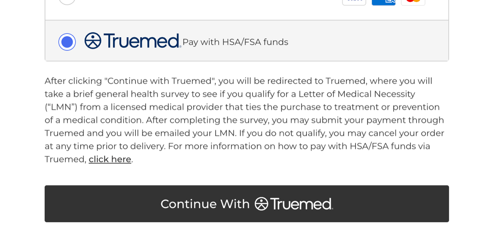

Truemed works with BigCommerce stores to let your customers pay for eligible products with HSA and FSA funds. This article is a high-level overview of how the integration works and what's involved in getting set up.

***

## What Customers See at Checkout

When a customer reaches your checkout, Truemed appears as a payment option alongside your other payment methods. Selecting it walks the customer through a short clinical intake form reviewed by an independent licensed practitioner. If the practitioner determines medical necessity, a Letter of Medical Necessity (LMN) is issued and the customer can complete their purchase using their HSA or FSA card.

***

## How Setup Works

The Truemed team handles the heavy lifting of installation. Once your account is approved:

1. You invite the Truemed team into your BigCommerce admin
2. The Truemed team installs and configures the integration
3. You complete a few small configuration steps on your end, like setting up the payment display and updating one email template
4. We run a test order together to confirm everything works before you go live

Most merchants are fully launched within a few business days of approval.

***

## What You'll Need

- An active BigCommerce store
- Admin access to invite the Truemed team
- A US-based business with a Stripe account (set up during Truemed onboarding)
- An optimized one page checkout (Settings → Checkout)
- No active "cash on delivery" payment method (Settings → Payments → Offline payment methods)

***

## Next Steps

When you're ready to begin installation, your Truemed Solutions Engineer will walk you through the step-by-step BigCommerce installation. To learn more or get approval to start, contact [merchants@truemed.com](mailto:merchants@truemed.com).

***

## Need Help?

For BigCommerce setup questions, contact [merchants@truemed.com](mailto:merchants@truemed.com).
