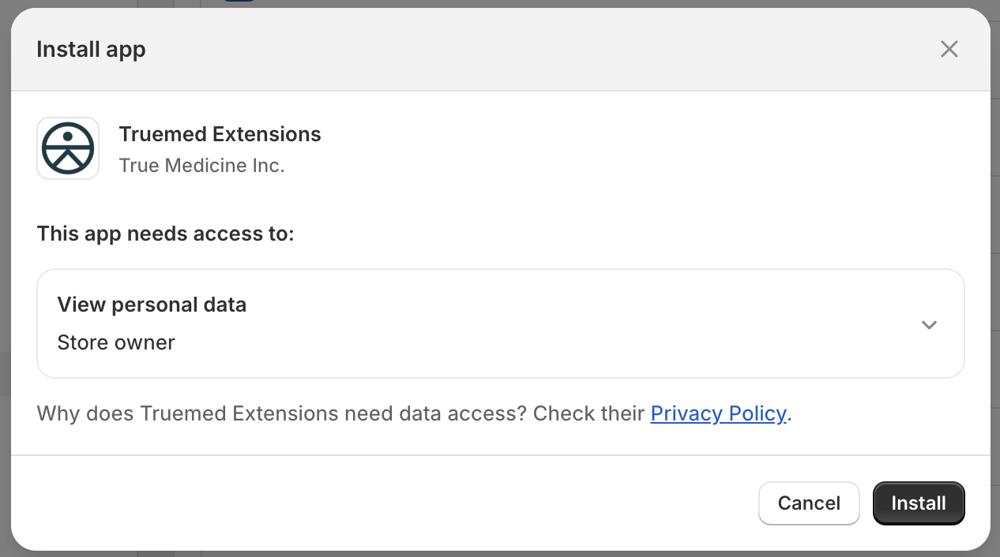
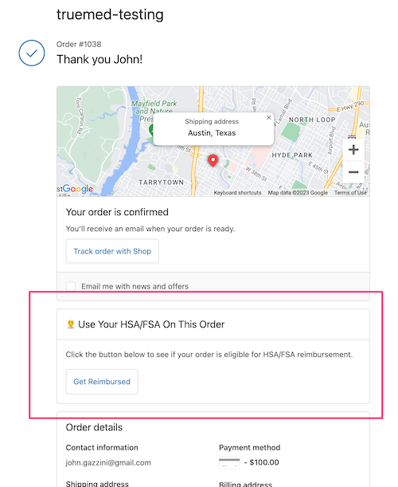
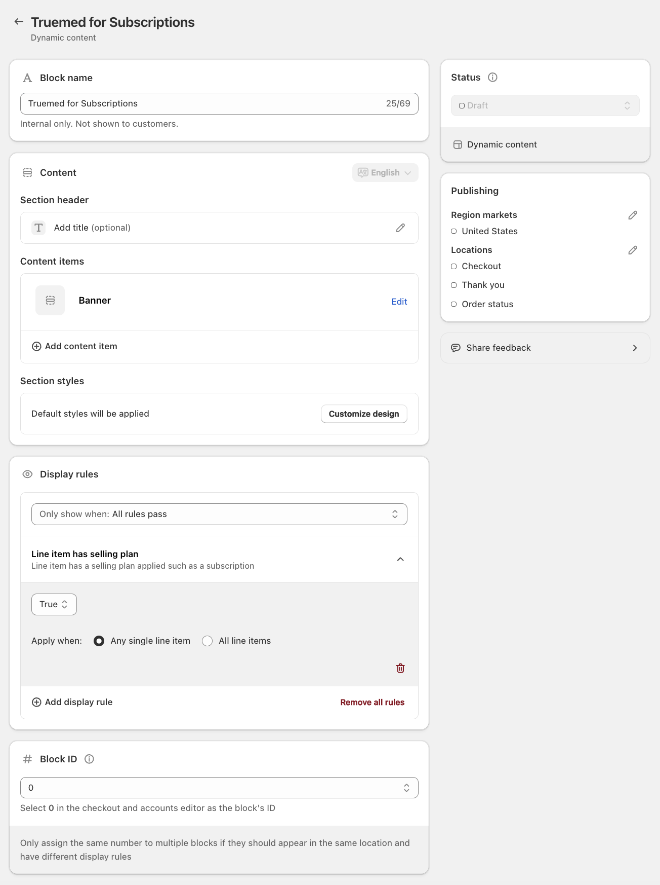

This guide walks you through installing and configuring Truemed on your Shopify store.

---

## Prerequisites

Before you begin, make sure you've completed:

- ☐ Uploaded your product catalog (Shopify CSV export with SKUs assigned)
- ☐ Connected your bank account via Stripe (see the [Stripe Onboarding & Connection](/getting-started/stripe-setup/stripe-onboarding-and-connection) article)
- ☐ Confirmed your Stripe account is at least "Enabled"
- ☐ Ensured you have Shopify **account owner or admin permissions**

---

## Step 1: Install the Truemed Payment App

The Truemed payment app is not listed on the public Shopify App Store. You will receive an install link from your Truemed contact.

1. Click the install link provided by Truemed
2. Review the app permissions and click **Install**
3. You'll land on the Truemed app settings page



<Warning>
**Do not activate the app yet** if your Truemed coordinator has instructed you to wait. You'll be told when it's time to activate.
</Warning>

---

## Step 2: Activate the Payment App

Once your Truemed account is configured and your products have been categorized:

1. Return to the app settings page (or navigate to **Settings > Payments > Additional payment methods** and search for "TrueMed")
2. Click **Activate**
3. **Leave the Visa, Mastercard, and American Express toggles ON.** This allows Truemed to process non-HSA/FSA cards when customers have insufficient HSA/FSA funds or their card is declined. We provide reimbursement instructions in these cases, and Truemed covers the credit card processing fees.

<Note>
After activation, the Truemed payment option is live immediately. Customers can begin checking out with HSA/FSA funds right away.
</Note>

---

## Step 3: Install the Product Page Widget

The product page (PDP) widget is the highest-impact promotion you can add. It educates customers about HSA/FSA eligibility right where they're making a purchase decision.


### Installation

1. Get your **Public Qualification ID** from [app.truemed.com/merchants/qualifications](https://app.truemed.com/merchants/qualifications) or your Truemed contact
2. In Shopify, go to **Online Store > Themes > Customize**
3. Open your product page template
4. Add a **Custom Liquid** block where you want the widget (typically near the price or "Add to Cart" button)
5. Paste the following code, replacing `YOUR_PUBLIC_QUALIFICATION_ID`:

```html
<div id="truemed-instructions" style="font-size: 14px;" icon-height="12" data-public-id="YOUR_PUBLIC_QUALIFICATION_ID"></div>
<script src="https://static.truemed.com/widgets/product-page-widget.min.js" defer></script>
```

### Dark Mode

For pages with dark backgrounds, add the `dark-mode` attribute:

```html
<div dark-mode id="truemed-instructions" style="font-size: 14px; color: #ffffff;" icon-height="12" data-public-id="YOUR_PUBLIC_QUALIFICATION_ID"></div>
<script src="https://static.truemed.com/widgets/product-page-widget.min.js" defer></script>
```

### Show Widget Only on Eligible Products

Use Shopify product tags to control widget visibility:

- Tag products as `truemed-eligible` and add `shopify-tags="display-if-eligible"` to the div
- Or tag ineligible products as `truemed-ineligible` and add `shopify-tags="display-unless-ineligible"`

```html
<div shopify-tags="display-if-eligible" id="truemed-instructions" style="font-size: 14px;" icon-height="12" data-public-id="YOUR_PUBLIC_QUALIFICATION_ID"></div>
<script src="https://static.truemed.com/widgets/product-page-widget.min.js" defer></script>
```

### Common Style Customizations

| Customization | CSS |
|---------------|-----|
| Change "Learn how" link color | `.truemed-instructions-open { color: #7a7a7a !important; }` |
| Prevent logo oversizing | `.truemed-logo-img { height: 13px !important; }` |
| Keep logo inline with text | `.truemed-logo-img { margin: 2px 0 0 3px !important; }` |
| Add spacing above/below | Add `margin-top` or `margin-bottom` to the div's `style` attribute |

---

## Step 4: Add the Thank You Page Widget (Hybrid/Subscription Merchants)

If you also sell subscription products, you'll want to add the qualification link to your order confirmation page so customers can complete the reimbursement flow after purchase.



### Option A: Checkout Extensibility (Recommended)

If your store uses Shopify's Checkout Extensibility:

1. Visit [apps.shopify.com/truemed-extensions](https://apps.shopify.com/truemed-extensions) and click **Install**
2. Follow the setup prompts and enter your **Truemed Public ID**
3. Save your changes

<Tip>
Your Public ID is the last part of your Qualification Link, found at [app.truemed.com/merchants/qualifications](https://app.truemed.com/merchants/qualifications).
</Tip>

### Option B: Additional Scripts (Legacy)

If your store has not migrated to Checkout Extensibility:

1. Find your Qualification Link at [app.truemed.com](https://app.truemed.com)
2. Go to **Settings > Checkout > Additional Scripts**
3. Paste the following in the "Order status page" section:

```html
<div id="truemed-reimburse" data-url="YOUR_QUALIFICATION_LINK"></div>
<script src="https://truemed-public.s3.us-west-1.amazonaws.com/truemed-ads/confirmation-widget-v1.1.min.js"></script>
```

---

## Step 5: Add Qualification Link to Order Confirmation Email

Including the qualification link in your order confirmation email ensures customers who miss the Thank You page can still access it.

1. In Shopify, go to **Settings > Notifications > Order Confirmation**
2. Add the following snippet to your email template, replacing the placeholder with your qualification link:

```html
<p>This order might be eligible for HSA/FSA reimbursement. <a href="YOUR_QUALIFICATION_LINK?source=order_confirm">Get Reimbursed</a>.</p>
```

---

## Step 6: Add Checkout Messaging for Subscriptions (Optional)

If you sell subscription products, we recommend adding a checkout banner using the **Checkout Blocks** app so customers understand the post-purchase reimbursement process.



1. Install [Checkout Blocks](https://apps.shopify.com/checkout-blocks) from the Shopify App Store
2. Create a **Dynamic Content Block** with a Banner template
3. Set a display rule: show only when any line item has a selling plan (subscription)
4. Use this approved copy:

> **Title:** Save an average of 30% when you use your HSA/FSA funds through Truemed.
>
> **Content:** Once you've purchased, fill out the Truemed health intake form on your order confirmation page to check if you qualify for HSA/FSA reimbursement. HSA/FSA tax savings vary. Learn more at [truemed.com/disclosures](https://www.truemed.com/disclosures).

5. Limit publishing region to **United States**
6. Follow the Checkout Blocks setup guide to add the block to your checkout

---

## Step 7: Verify Your Setup

After completing setup, run through these checks:

- ☐ Visit a product page and confirm the HSA/FSA widget appears
- ☐ Start a test checkout and verify "Truemed" appears as a payment option
- ☐ If applicable, add a subscription item to cart and check for the checkout banner
- ☐ Place a test order and verify it appears in your [Truemed Dashboard](https://app.truemed.com)
- ☐ Check your order confirmation page for the qualification link (if reimbursement flow is enabled)

---

## Shopify Permissions Reference

To install and manage the Truemed payment app, you need one of the following Shopify roles:

| Role | Can Install App | Can Manage Settings |
|------|-----------------|---------------------|
| Store Owner | Yes | Yes |
| Staff (with Apps permission) | Yes | Yes |
| Staff (limited) | No | No |

---

## Theme Compatibility

The Truemed payment app works with all Shopify themes. Changing your theme will not affect the payment integration. However, if you switch themes, you may need to re-add the product page widget to your new template.

---

## Need Help?

- **Technical issues:&#x20;**[merchants@truemed.com](mailto:merchants@truemed.com)
- **Dashboard access:&#x20;**[app.truemed.com](https://app.truemed.com)
- Refer to the [Shopify Issues](/troubleshooting/shopify-issues) article for common issues
