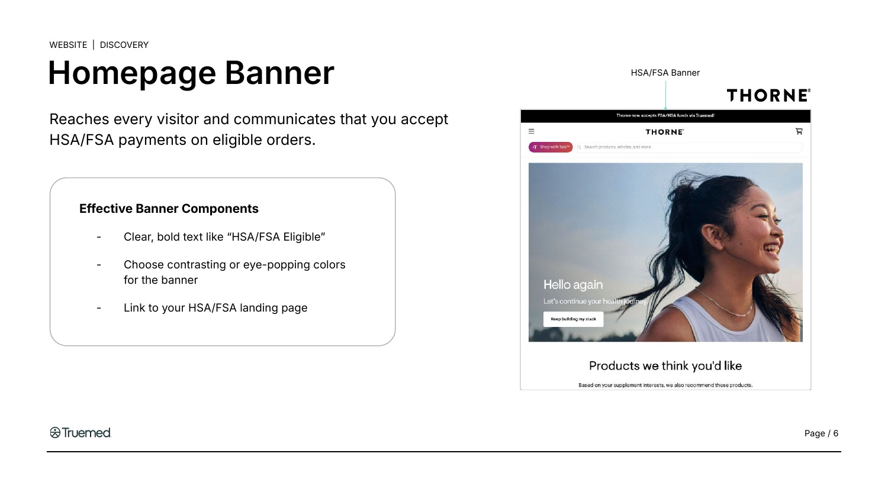
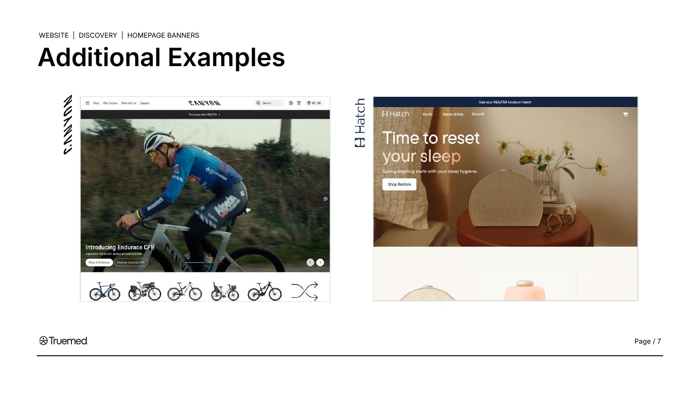
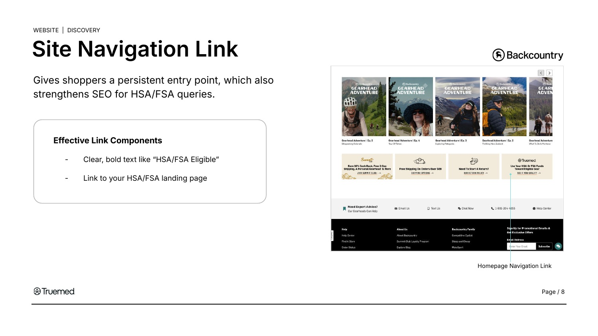
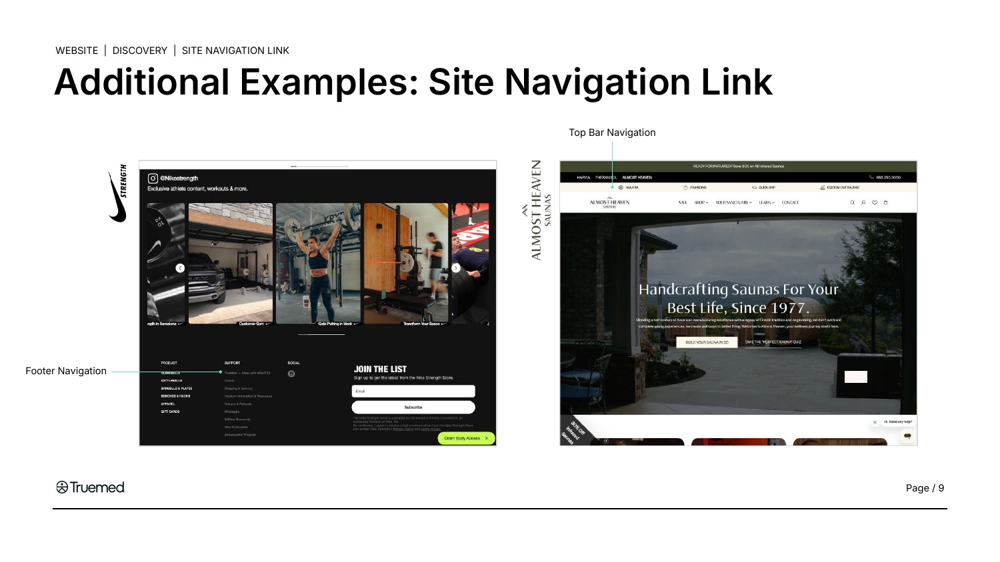
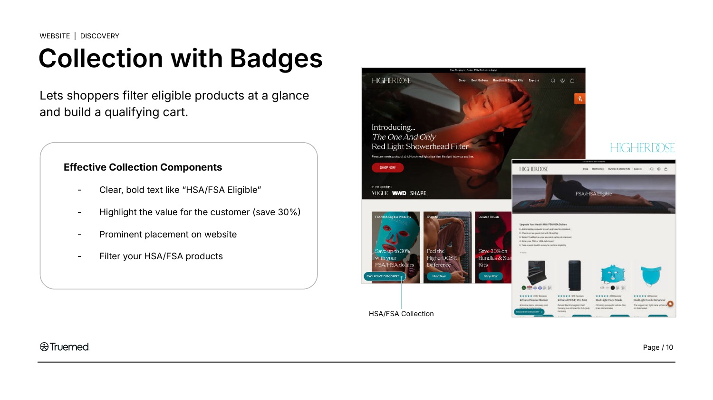

<iframe
  src="https://www.loom.com/embed/7d58866895fa4245aaed82fe5e3716dc"
  width="100%"
  height="450px"
  frameBorder="0"
  allowFullScreen
></iframe>

A shopper who doesn't know you accept HSA/FSA can't use it. Discovery closes that awareness gap by surfacing eligibility messaging from the moment someone lands on your site, not just at checkout.

Start with the homepage banner, then add navigation links, then build out your product collection.

## 1. Add an HSA/FSA Homepage Banner

A homepage banner reaches every visitor, including those who never browse your product catalog.

Keep the copy to one line plus a CTA. Your banner should communicate that you accept HSA/FSA, that shoppers may save on eligible purchases, and where to learn more.

### Sample copy:

- "Save with HSA/FSA on eligible products"

  "\[Your Brand] now accepts HSA/FSA via Truemed!"

  "Purchase with HSA/FSA on eligible orders"

More banner examples from Truemed partners:

### How to Implement

1. Create a new banner or banner element in your site admin.
2. Add your HSA/FSA copy.
3. Link the CTA to your HSA/FSA landing page or product collection.

---

## Add HSA/FSA to Your Site Navigation

A dedicated nav item ensures shoppers find your HSA/FSA offering without relying on site search or scrolling. It also strengthens your SEO by signaling page importance to search engines and helps AI search tools surface your offering for queries like "[your brand] HSA/FSA."

Placement works in the top bar, the footer, or both. Nike Strength lists Truemed under its footer navigation, while Almost Heaven Saunas puts HSA/FSA in the top bar.

### How to Implement

1. Open your navigation settings in your site admin.
2. Add a menu item labeled "HSA/FSA" or "HSA/FSA Eligible" to your top navigation bar.
3. Link it to your HSA/FSA landing page or product collection.

<Tip>
If you don't have a landing page yet, link to your product collection for now. You can update it once you build a landing page in the [Consideration](/consideration) stage.
</Tip>

---

## Create an HSA/FSA Product Collection with Badges

Group your eligible products into a dedicated collection and add eligibility badges to product cards. This gives shoppers a single destination for everything they can purchase with pre-tax funds, and badges make eligible products instantly recognizable across your entire site.

You don't need to determine which products are eligible. Truemed provides your approved product list during onboarding based on IRS guidelines.

HigherDOSE leads its collection tile with a savings claim, which is an effective hook. If you use savings copy like this, it needs the asterisk and the disclaimer described under Compliance below.

### Collection Page

Create a dedicated collection or category page that groups all eligible products. This gives you a single URL to link from navigation, banners, emails, and ads.

If your catalog has more than a handful of eligible products, organize them into sub-categories so shoppers can browse by product type rather than scrolling one long list. Backcountry does this with 4,500+ eligible products across categories like footwear, bikes, and smart watches.

### Product Badges

Add an "HSA/FSA Eligible" badge or tag to each eligible product card, visible on collection pages, category pages, and search results.

{/* IMAGE: Close-up of product cards with "HSA/FSA Eligible" badges on the thumbnails. */}

Truemed provides [official badge assets](https://www.figma.com/design/iUWOaJ5LTuF3FORraDCUum/2025-Merchant-Marketing-Design--Copy-Only-?node-id=3505-15\&p=f\&t=7JUhRSTFKhiEJkiP-0) you can upload directly. You can also create your own badge as long as the copy reads "HSA/FSA Eligible\*" with an asterisk and the required disclaimer appears on the page.

{/* LINK NEEDED: Direct link to downloadable Truemed badge assets. */}

For Shopify merchants, badges can typically be added through your theme's product card template or a badge app.

{/* LINK NEEDED: Shopify collection setup guide. */}

### Filter Option

For large, mixed-eligibility catalogs, add a left-rail filter ("HSA/FSA Eligible\*") so shoppers can narrow any category to eligible products only. This may require support from your dev team.

<Warning>
Badges must be product-level. Only eligible products should carry the badge. Do not apply a banner across a mixed category page that implies all products are eligible.
</Warning>

---

## Compliance Reminder

All HSA/FSA messaging on your site must include the following disclaimer:

*Truemed is for qualified customers. HSA/FSA tax savings vary. Learn more at truemed.com/disclosures.*

For product pages and collection pages, include it on the same page where eligibility is promoted.

Want Truemed's team to review your assets before go-live? Email your Customer Success Manager or [partners@truemed.com](mailto:partners@truemed.com).

For the full compliance reference, see the [Compliant HSA/FSA Messaging Guide](/compliant-messaging).

---

## More Partner Examples

<Info title="Partner Marketing Best Practices deck">
The examples on this page come from our Partner Marketing Best Practices deck. The full deck covers all three website stages plus email and social, with additional examples from partners like Thorne, Backcountry, Purple, and Momentous.

<Download src="./assets/truemed-partner-marketing-best-practices.pdf">
  <Button intent="primary">Download the best practices deck (PDF, 3 MB)</Button>
</Download>
</Info>

---

## Next Steps

Once eligibility is visible across your site, move to [Consideration](/consideration) to build the landing page and FAQ that help qualified shoppers understand how to pay with Truemed.

Need help? Your Customer Success Manager can review your Discovery implementation. For general support, email [partners@truemed.com](mailto:partners@truemed.com).
