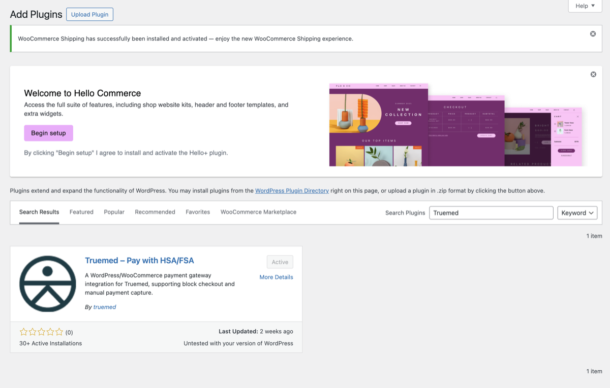
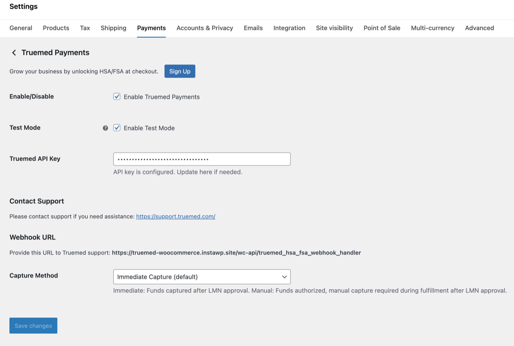
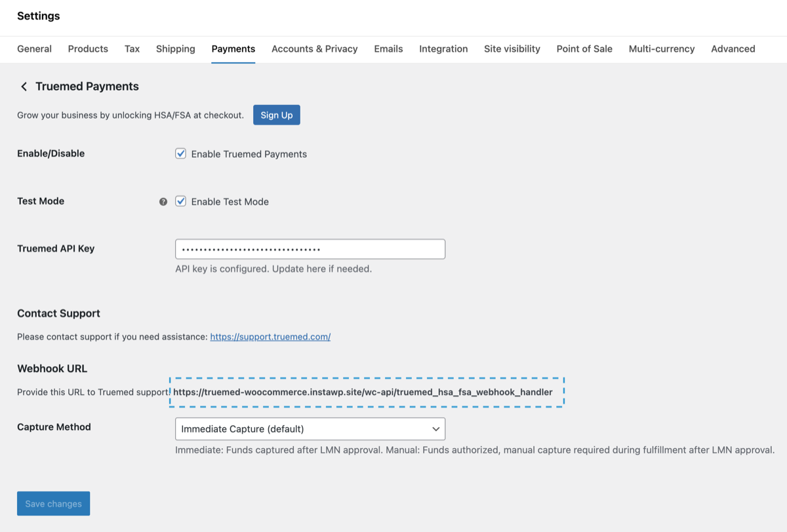
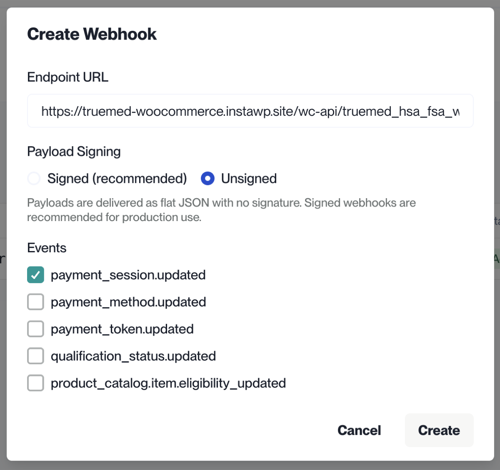
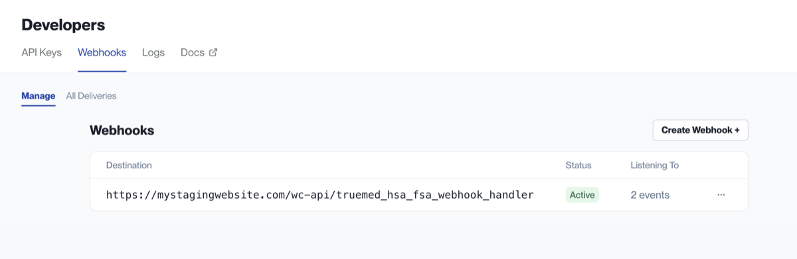
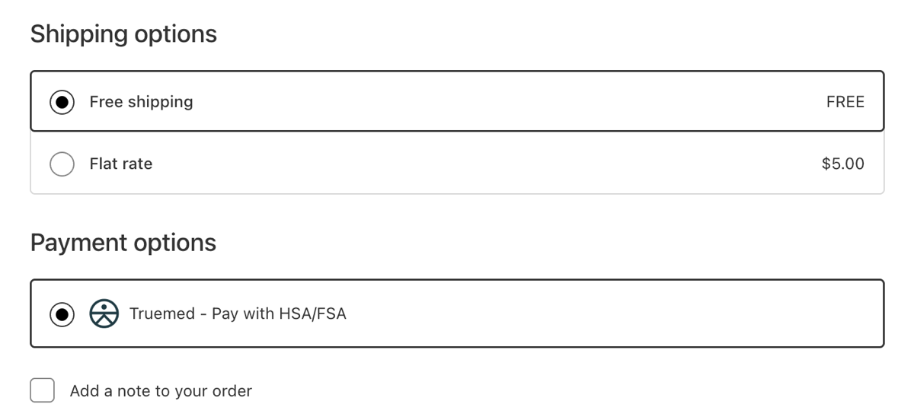
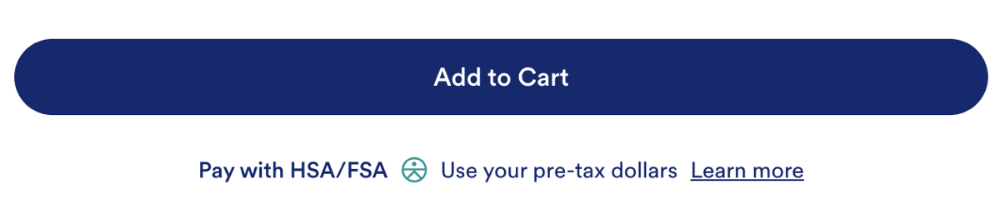

This guide walks you through installing and configuring Truemed on your WooCommerce store. Once complete, "Pay with HSA/FSA (Truemed)" appears as a payment option at checkout, alongside your existing payment methods.

The full setup takes most merchants about an hour, plus time for testing.

***

## Prerequisites

Before you begin, make sure you have:

- Confirmation from your Truemed contact that you're cleared to begin installation
- Your sandbox and production API keys (you'll generate these during setup)
- WordPress admin access with permissions to install plugins
- Your WooCommerce store running on a publicly accessible domain (required for webhooks)

***

## Step 1: Install the Truemed Plugin

The [Truemed Payments plugin](https://wordpress.org/plugins/truemed-hsa-fsa-payments/) is published in the WordPress Plugin Directory. You can install it directly from your WordPress admin or download the zip and upload it manually.

### Option A: Install from WordPress admin (recommended)

1. In your WordPress admin, go to **Plugins → Add New**
2. Search for **Truemed HSA/FSA Payments**
3. Click **Install Now**, then **Activate**

### Option B: Upload the zip

1. Download the plugin from [wordpress.org/plugins/truemed-hsa-fsa-payments](https://wordpress.org/plugins/truemed-hsa-fsa-payments/)
2. In your WordPress admin, go to **Plugins → Add New → Upload Plugin**
3. Select the zip file and click **Install Now**, then **Activate**



***

## Step 2: Configure Your API Key

Set up Truemed in sandbox mode first, run a test transaction, then switch to production.

1. Generate your sandbox API key at [dev.truemed.com/developers/api-keys](https://dev.truemed.com/developers/api-keys)
2. In WordPress, go to **WooCommerce → Settings → Payments**
3. Find **Truemed Payments** in the list and click **Manage**
4. Paste your sandbox API key into the **Truemed API Key** field
5. Check the **Enable Test Mode** box
6. Click **Save changes**

<Note>
Test mode only works with a sandbox API key. Mixing a sandbox key with test mode disabled (or a production key with test mode enabled) will cause transactions to fail.
</Note>



***

## Step 3: Configure the Webhook URL

The plugin generates a webhook URL specific to your store. Register that URL in your Truemed admin so Truemed can notify your store when an LMN is approved or a payment status changes.

1. On the same Truemed plugin settings page, copy the **Webhook URL** shown
2. Go to [dev.truemed.com/developers/webhooks/manage](https://dev.truemed.com/developers/webhooks/manage) (sandbox)
3. Click **Create Webhook**
4. Add the webhook URL you copied from the WooCommerce plugin page under **Endpoint URL**
5. Choose **Unsigned** under **Payload Signing**
6. Choose **payment_session.updated** under **Events**
7. Check the **I understand the endpoint could not be verified. Save anyway.** box
8. Save

You'll repeat this step with your production webhook URL when you go live (Step 7).







***

## Step 4: Enable Truemed at Checkout

1. On the Truemed plugin settings page, click the **Enable** toggle
2. Save changes

Truemed now appears as a payment option on your checkout page. In sandbox mode, only test transactions will work.



***

## Step 5: Add the Product Page Widget

The product page widget educates shoppers about HSA/FSA eligibility right where purchase intent is highest. It signals that the product may qualify for HSA/FSA reimbursement and links to a "Learn how" explainer.



### Get your Public Qualification ID

Find your Public Qualification ID in your integration guide or ask your Truemed contact.

### Add the widget code

Paste this snippet into your product page template, replacing `YOUR_PUBLIC_QUALIFICATION_ID`:

```html
<div id="truemed-instructions" style="font-size: 14px;" icon-height="12" data-public-id="YOUR_PUBLIC_QUALIFICATION_ID"></div>
<script src="https://static.truemed.com/widgets/product-page-widget.min.js" defer></script>
```

### Dark mode

For pages with dark backgrounds, add the `dark-mode` attribute and adjust the text color:

```html
<div dark-mode id="truemed-instructions" style="font-size: 14px; color: #ffffff;" icon-height="12" data-public-id="YOUR_PUBLIC_QUALIFICATION_ID"></div>
<script src="https://static.truemed.com/widgets/product-page-widget.min.js" defer></script>
```

***

## Step 6: Test Your Setup

Before switching to production, run a full test transaction in sandbox mode.

### Place a test order

1. Open your storefront in an incognito window
2. Add a product to your cart and proceed to checkout
3. Select **Pay with HSA/FSA (Truemed)** as the payment method
4. Complete the Truemed flow using the Stripe test card:
   - **Card number:** 4242 4242 4242 4242
   - **Expiration:** any future date
   - **CVC and ZIP:** any values
5. Confirm you land back on the order confirmation page

The order will appear in WooCommerce with status **On Hold**, waiting on LMN approval.

### Approve the test LMN

1. Log in to your sandbox dashboard at [dev.truemed.com](https://dev.truemed.com/)
2. Find the test order (payment session) and approve the LMN
3. Refresh your WooCommerce order page; status should change from **On Hold** to **Processing**

If the status doesn't update within a few minutes, your webhook URL likely isn't configured correctly. Recheck Step 3.

***

## Step 7: Go Live in Production

Once your test transaction settles cleanly, switch to production.

1. Generate your production API key at [app.truemed.com/developers/api-keys](https://app.truemed.com/developers/api-keys)
2. In WooCommerce, go to **WooCommerce → Settings → Payments → Truemed Payments → Manage**
3. Replace the sandbox API key with your production API key
4. Uncheck **Enable Test Mode**
5. Save changes
6. Copy the new webhook URL shown in the plugin settings
7. Register that webhook URL at [app.truemed.com/developers/webhooks/manage](https://app.truemed.com/developers/webhooks/manage)
8. Place a small live order from your storefront to confirm the production flow works end to end

Truemed is now live for your customers.

<Warning>
Don't skip the live test order. Sandbox and production are separate environments, and a webhook misconfigured in production will leave real customer orders stuck in **Pending Payment**.
</Warning>

***

## Step 8: Handle Subscriptions (If Applicable)

The Truemed WooCommerce plugin does not currently support subscription products at checkout. Subscription customers can still get an LMN through Truemed, but the flow happens after purchase.

Surface a Truemed reimbursement link on your order confirmation page and in your order confirmation email. After purchasing, the customer clicks the link, completes the Truemed clinical intake form, and if an independent licensed practitioner determines medical necessity, an LMN is issued for the customer to submit to their HSA/FSA administrator.

### Get your reimbursement link

Find your Qualification Link in your integration guide or ask your Truemed contact.

### Add the link to your order confirmation page

Add a snippet like this to your WooCommerce **Thank You** page (typically via the `woocommerce_thankyou` hook in your theme's `functions.php` or through a code snippets plugin):

```html
<p>This order may be eligible for HSA/FSA reimbursement. <a href="YOUR_QUALIFICATION_LINK?source=order_confirm">Get reimbursed with Truemed</a>.</p>
```

### Add the link to your order confirmation email

1. In WordPress, go to **WooCommerce → Settings → Emails**
2. Find **Processing order** (or **Completed order**, depending on your fulfillment flow) and click **Manage**
3. Add the same snippet to the **Additional content** field, or override the email template in your theme

***

## Verify Your Setup

After completing setup, run through this checklist:

- Truemed is set to **Enabled** in WooCommerce → Settings → Payments
- **Enable Test Mode** is unchecked
- Production API key is in place
- Correct Capture Method is selected
- Production webhook URL is registered at [app.truemed.com/developers/webhooks/manage](https://app.truemed.com/developers/webhooks/manage)
- The product page widget appears on a live product page
- "Pay with HSA/FSA (Truemed)" appears at checkout
- A live test order completes and shows up in your [Truemed dashboard](https://app.truemed.com/)
- If you sell subscriptions, the reimbursement link appears on the order confirmation page and email

***

## Managing Orders

Once Truemed is live, you'll manage Truemed orders directly from the standard WooCommerce orders dashboard.

### Order statuses

| Status | Meaning |
| --- | --- |
| **Pending Payment** | Customer has not completed Truemed checkout |
| **On Hold** | Customer has completed checkout and is waiting on LMN approval or rejection |
| **Processing** | LMN approved and payment authorized; order is ready to fulfill |
| **Expired** | The authorization hold expired before capture; the order can no longer be charged |

<Note>
Truemed authorization holds are valid for 6.95 days. If an order isn't captured within that window, the auth expires and Truemed does not re-authorize. Capture orders promptly to avoid expirations.
</Note>

### Order actions

From any Truemed order, you can:

- **Cancel** an order before capture
- **Refund** an order after capture (full or partial)
- **Capture** an order manually (if manual capture is enabled)

### Manual capture

By default, Truemed captures payment automatically once the LMN is approved. If you'd prefer to capture manually (for example, on ship), enable it in the Truemed plugin settings under **Capture Method**. With manual capture enabled, approved orders sit in **On Hold** until you trigger the capture from the order dashboard.

***

## Need Help?

- **Implementation questions:** Reach out to your Truemed implementation contact
- **Technical issues post-launch:** [merchants@truemed.com](mailto:merchants@truemed.com)
- **Dashboard access:** [app.truemed.com](https://app.truemed.com/)
- **Developer reference:** [developers.truemed.com](https://developers.truemed.com/guides/implementation/woo-commerce/introduction-to-truemeds-woo-commerce-integration)
