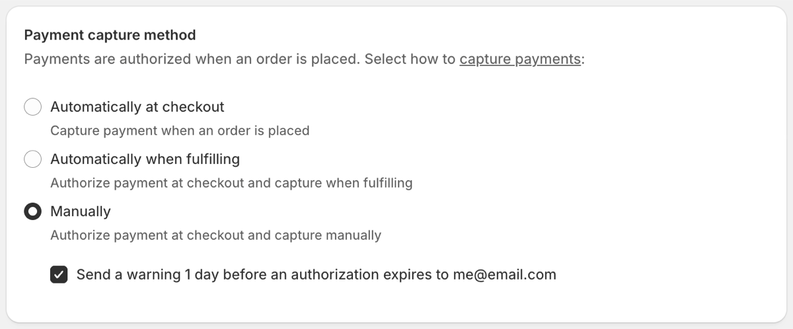

Truemed runs payments on our own rails, which means we handle fraud protection on our end. We use Stripe Radar to identify and block fraudulent purchase attempts. There are a few implementation-specific considerations, detailed below.

***

## For Shopify Partners

When a Truemed payment session is created, Shopify passes us all the information we need to assess the order for fraud. There's nothing for you to configure on your end.

As an additional layer of security, you can optionally enable **Manual Capture** or **Capture Upon Fulfillment** on your store. These are Shopify store-level settings (not Truemed app settings), and the Truemed Payment App will comply with whichever option is configured.

<Warning>
If your store uses a third-party fraud detection app that requires manual capture and captures orders based on its own assessment, that app may not be able to properly assess Truemed orders. Because Truemed payments are processed offsite, Truemed orders may remain uncaptured indefinitely. If you're using a third-party fraud app, verify the behavior with Truemed orders during testing or shortly after going live. Your Truemed integration team can recommend Shopify Flow options as a workaround in this scenario.
</Warning>

***

## For WooCommerce and BigCommerce Partners

Like our Shopify integration, our WooCommerce and BigCommerce apps pass all order information to Truemed automatically. Fraud detection runs without any configuration on your end.

Our WooCommerce app supports **Manual Capture**, which can be enabled at the store level for an additional layer of pre-fulfillment review.

***

## For API Partners

Truemed supports several optional fields on [payment session creation requests](https://developers.truemed.com/api-reference/payment-sessions/create-payment-session) that improve our ability to use Stripe Radar to detect fraud:

- Shipping name
- Shipping address
- Billing name
- Billing address

You can also choose to create payment sessions with `type=authorization` as an additional safeguard against any fraud that passes Stripe Radar's initial screening. With authorization-type sessions, funds are held rather than immediately captured, giving you an opportunity to review orders before finalizing. Authorizations expire after 7 days if not captured.

***

## What Happens When Fraud Is Detected

When Truemed's fraud checks flag a payment, the payment session is blocked and not allowed to proceed. The customer cannot complete the purchase using Truemed.

Blocked orders will not appear in your dashboard if you're on BigCommerce, WooCommerce, or an API integration. On Shopify, blocked orders may surface in your dashboard as "pending." These orders will not complete and can be safely ignored.

***

## Disputes and Chargebacks

For information on how disputes and chargebacks are handled, see the [Disputes & Chargebacks](/troubleshooting/disputes-and-chargebacks) article.

***

## Need Help?

Reach out to [merchants@truemed.com](mailto:merchants@truemed.com).
